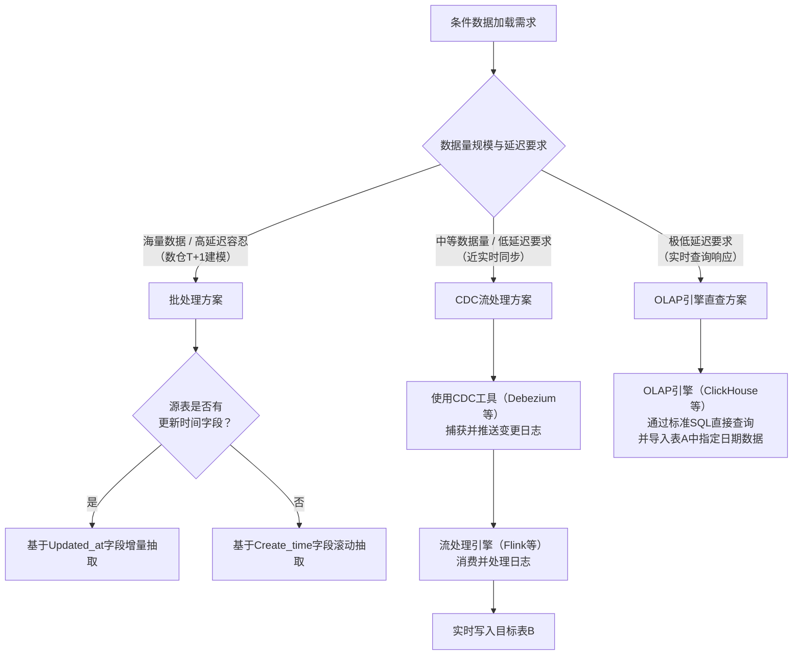

# mianjin
# 什么是可重入锁？什么是排他锁？这两个有啥关系？Java里有哪些相关内容
## 锁
好的，这是一个关于并发编程非常核心的概念。我们来彻底讲清楚。

---

### 1. 排他锁 (Exclusive Lock)

**核心思想**：**“独享”**。就像厕所的**独立单间**。

*   **定义**：排他锁也叫互斥锁。它保证在同一时间，只有一个线程能持有该锁，并访问被锁保护的资源或代码段。
*   **类比**：一个厕所只有一个坑位（锁），一次只能一个人（线程）用。其他人（线程）必须在门口排队等待，直到里面的人出来（释放锁）。
*   **目的**：保证共享资源的**原子性**和**可见性**，避免数据竞争和不一致。
*   **Java中的典型代表**：
    *   `synchronized` 关键字（隐式锁）
    *   `ReentrantLock`（默认模式）
    *   读写锁中的**写锁**

---

### 2. 可重入锁 (Reentrant Lock)

**核心思想**：**“可重复进入”**。就像**有钥匙的人可以反复进入自家大门**。

*   **定义**：指的是一个线程在已经持有某个锁的情况下，可以再次成功获取**同一个锁**，而不会被自己阻塞。
*   **为什么需要它？** 防止**死锁**。考虑以下场景：
    ```java
    public synchronized void methodA() {
        methodB(); // 如果锁不可重入，这里就会死锁！
    }

    public synchronized void methodB() {
        // do something
    }
    ```
    *   线程T进入 `methodA()`，获得了 `this` 对象锁。
    *   `methodA()` 内部调用 `methodB()`，而 `methodB()` 也需要获取 `this` 对象锁。
    *   **如果锁不可重入**：T已经持有锁，但尝试再次获取时会被阻塞。T会永远等待一个自己持有的锁，导致死锁。
    *   **如果锁可重入**：JVM会识别出这个锁已经是T持有的，于是直接放行，并增加一个持有计数（+1）。当 `methodB()` 执行完毕，计数减一；`methodA()` 执行完毕，计数归零，锁才真正释放。

*   **实现机制**：内部维护一个**持有线程的引用**和一个**计数器**。同一线程每次获取锁，计数器+1；每次释放锁，计数器-1；计数器为0时，才真正释放锁。

*   **Java中的典型代表**：
    *   **所有的 `synchronized` 锁都是可重入的**。这是JVM内置的特性。
    *   `java.util.concurrent.locks.ReentrantLock`，看名字就知道，它也是可重入的。

---

### 3. 两者的关系：不是对立，而是维度不同

这是一个非常关键的理解点。**可重入性和排他性是从两个不同维度来描述锁的特性**，它们不是非此即彼的对立关系。

| 维度 | 描述 | 例子 |
| :--- | :--- | :--- |
| **锁的访问策略** | **排他 vs 共享** | **排他锁**（如写锁） vs **共享锁**（如读锁） |
| **锁的持有策略** | **可重入 vs 不可重入** | **可重入锁**（如`synchronized`） vs **不可重入锁**（需自己实现） |

你可以把它们想象成一个二维分类：


**所以，一个锁完全可以既是排他锁，又是可重入锁。** 事实上，在Java中，我们最常用的锁（`synchronized` 和 `ReentrantLock`）都是**可重入的排他锁**。

它们同时具备了两种特性：
1.  **排他性**：保证线程安全，一次只有一个线程能执行。
2.  **可重入性**：防止同一线程在锁内部调用其他同步方法时发生死锁。

---

### 4. Java中的相关内容与实践

#### 1. synchronized (内置锁/隐式锁)
```java
public class SynchronizedExample {
    // 这是一个可重入的排他锁
    public synchronized void outer() {
        System.out.println("Outer method");
        inner(); // 可重入：线程可以再次进入同一个锁保护的inner方法
    }

    public synchronized void inner() {
        System.out.println("Inner method");
    }
}
```

#### 2. ReentrantLock (显式锁)
`ReentrantLock` 是 `synchronized` 的增强版，提供了更多高级功能，如**尝试获取锁、公平锁、可中断的锁等待、条件变量**等。

```java
import java.util.concurrent.locks.ReentrantLock;

public class ReentrantLockExample {
    private final ReentrantLock lock = new ReentrantLock(); // 创建一个可重入的排他锁

    public void outer() {
        lock.lock(); // 获取锁
        try {
            System.out.println("Outer method");
            inner(); // 可重入：可以再次lock()
        } finally {
            lock.unlock(); // 必须在finally中释放锁！
        }
    }

    public void inner() {
        lock.lock(); // 再次获取同一个锁
        try {
            System.out.println("Inner method");
        } finally {
            lock.unlock(); // 释放一次
        }
    }
    // outer()中lock()了2次，所以也需要unlock()2次，锁才会真正释放。
}
```

#### 3. ReentrantReadWriteLock (读写锁)
它展示了**排他锁（写锁）** 和**共享锁（读锁）** 的区别，但其中的读锁和写锁**本身都是可重入的**。

*   **写锁 (WriteLock)**：**排他且可重入**。就像`synchronized`，一次只有一个线程能持有写锁。
*   **读锁 (ReadLock)**：**共享且可重入**。多个线程可以同时持有读锁，但不允许有写锁存在。

```java
import java.util.concurrent.locks.ReentrantReadWriteLock;

public class ReadWriteLockExample {
    private final ReentrantReadWriteLock rwLock = new ReentrantReadWriteLock();
    private final ReentrantReadWriteLock.ReadLock readLock = rwLock.readLock();
    private final ReentrantReadWriteLock.WriteLock writeLock = rwLock.writeLock();

    // 读操作：多个线程可同时进入
    public String read() {
        readLock.lock(); // 获取共享的、可重入的读锁
        try {
            // ... 读取数据
            return data;
        } finally {
            readLock.unlock();
        }
    }

    // 写操作：一次只有一个线程可进入
    public void write(String newData) {
        writeLock.lock(); // 获取排他的、可重入的写锁
        try {
            // ... 写入数据
        } finally {
            writeLock.unlock();
        }
    }
}
```

---

### 总结对比

| 特性 | 排他锁 (Exclusive Lock) | 可重入锁 (Reentrant Lock) |
| :--- | :--- | :--- |
| **核心概念** | 锁的**访问策略**：一次只有一个线程能持有。 | 锁的**持有策略**：持有锁的线程可以再次获取它。 |
| **对立面** | **共享锁** (如 `ReadWriteLock` 中的读锁) | **不可重入锁** (Java标准库没有，需自定义) |
| **关系** | **维度不同，互不排斥**。常见的锁（如`synchronized`）同时具备这两种特性。 | |
| **Java代表** | `synchronized`, `ReentrantLock`, `ReentrantReadWriteLock.WriteLock` | `synchronized`, `ReentrantLock`, `ReentrantReadWriteLock.ReadLock/WriteLock` |
| **主要目的** | 保证数据操作的**原子性和一致性**。 | 防止**线程自死锁**，提高代码设计的灵活性。 |

**一句话概括**：我们平时用的 `synchronized` 和 `ReentrantLock` 都是**可重入的排他锁**。它们既能保证线程安全（排他），又能让同一线程无障碍地进入嵌套的同步代码块（可重入）。

# 为什么数据库连接 文件流 线程池等不指定关闭会引起内存泄露？这些资源不会被gc回收吗
## 内存泄漏 gc
这是一个非常核心且重要的问题。你问到了点子上。简单来说：**这些资源不会被GC回收，或者更准确地说，GC无法回收它们所代表的底层系统资源。**

GC（Garbage Collector）是Java虚拟机（JVM）的一部分，它只能管理**JVM堆内存**中的对象。而数据库连接、文件流、线程池等，涉及的是**JVM之外的操作系统资源**。

下面我们来详细拆解这个问题。

---

### 1. GC 能回收什么？不能回收什么？

*   **GC能回收的**：在JVM堆上创建的Java对象（例如，一个 `FileInputStream` 对象实例本身所占用的那几十个字节的内存）。
*   **GC不能回收的**：Java对象背后所持有的**本地资源（Native Resources）**，例如：
    *   **文件句柄（File Handle）**：操作系统分配给一个打开文件的标识符。
    *   **套接字（Socket）**：网络连接的端点。
    *   **数据库连接（Database Connection）**：与数据库服务器建立的TCP连接及其在服务器端的状态。
    *   **直接内存（Direct Memory）**：通过 `ByteBuffer.allocateDirect()` 分配的，存在于JVM堆外的内存。

这些资源是由**操作系统**或**外部系统（如数据库）** 分配和管理的。

### 2. 内存泄露是如何发生的？（以文件流为例）

我们来看一个典型的“资源泄露”过程：

```java
public void readFile() {
    try {
        FileInputStream fis = new FileInputStream("huge_file.txt"); // 1. 创建Java对象，并申请系统资源（文件句柄）
        // ... 读取文件操作
        // 忘记调用 fis.close();
    } catch (IOException e) {
        e.printStackTrace();
    }
    // 2. 方法结束，fis 局部变量超出作用域，FileInputStream 对象不可达。
    // 3. 在未来的某个时刻，GC 会回收这个 FileInputStream 对象在堆上占用的少量内存。
}
```

**关键点在于**：
1.  当你 `new FileInputStream(...)` 时，发生了两件事：
    *   **在JVM堆上**创建了一个Java对象（`fis`）。
    *   **在操作系统层面**，通过JNI（Java Native Interface）调用，打开了一个文件，并获取了一个“文件句柄”。这个句柄是操作系统资源。

2.  当你“忘记关闭”时，只做了 `fis = null;` 或等待方法结束，这只是切断了Java堆上的对象引用。

3.  GC工作后，会发现这个 `FileInputStream` 对象已经没有任何引用了，于是**回收它在堆上占用的那几十个字节的内存**。

4.  **但是**，GC**完全不知道**这个Java对象背后还关联着一个操作系统的文件句柄。它没有能力去调用操作系统的 `close()` 系统调用来释放这个句柄。

5.  最终结果：**Java对象被回收了，但系统的文件句柄被永久占用了**。

**泄露的后果**：
*   每个进程能打开的文件句柄数量是有限的（可以通过 `ulimit -n` 查看）。
*   如果你的程序反复执行上述方法，就会不断泄露文件句柄。
*   当泄露的句柄数达到系统上限时，再尝试打开新文件或建立数据库连接，就会抛出 `IOException: Too many open files` 错误，导致程序崩溃。

**这个过程就是“资源泄露”，它最终会导致内存泄露或其他系统资源耗尽的问题。**

---

### 3. 各类资源的泄露原理

| 资源类型 | Java对象 | 底层系统资源 | 泄露后果 |
| :--- | :--- | :--- | :--- |
| **数据库连接** | `Connection` 对象 | 1. TCP Socket 连接<br>2. 数据库服务器端的会话和缓冲区 | 1. 客户端端口耗尽<br>2. 数据库连接数达到上限，拒绝新连接 |
| **文件流** | `FileInputStream`/`FileOutputStream` | 操作系统的文件句柄 | `Too many open files` 错误 |
| **线程池** | `ExecutorService` 对象 | 池中的工作线程（也是系统资源） | 线程无法正常结束，JVM无法正常关闭（非守护线程会阻止JVM退出） |
| **网络Socket** | `Socket`/`ServerSocket` | 操作系统的Socket描述符和端口 | 端口耗尽，无法建立新的网络连接 |

### 4. 如何正确关闭资源？(现代最佳实践)

传统的方式是使用 `try-finally`，但现代Java（Java 7+）强烈推荐使用 **try-with-resources** 语句。

**传统方式（容易写错或忘记）：**
```java
FileInputStream fis = null;
try {
    fis = new FileInputStream("file.txt");
    // ... 使用流
} finally {
    if (fis != null) {
        try {
            fis.close(); // 在finally块中手动关闭
        } catch (IOException e) {
            // 处理关闭异常
        }
    }
}
```

**现代方式（自动、安全、简洁）：**
```java
// 实现了 AutoCloseable 接口的类都可以放在这里
try (FileInputStream fis = new FileInputStream("file.txt");
     FileOutputStream fos = new FileOutputStream("output.txt")) {
    // ... 使用流
} catch (IOException e) {
    e.printStackTrace();
}
// 无论是否发生异常，离开try块后JVM会自动调用 fis.close() 和 fos.close()
```

**对于线程池**，同样需要在应用关闭时显式调用 `shutdown()` 或 `shutdownNow()`。

```java
ExecutorService executor = Executors.newFixedThreadPool(10);
// ... 提交任务
// 应用结束时
executor.shutdown(); // 平缓关闭：停止接收新任务，等待已提交任务完成
// executor.shutdownNow(); // 立即关闭：尝试中断所有正在执行的任务
```

---

### 总结

| 问题 | 答案 |
| :--- | :--- |
| **GC会回收这些资源吗？** | **不会**。GC只能回收JVM堆内存中的Java对象，无法释放其背后的操作系统资源（文件句柄、网络连接等）。 |
| **为什么会内存泄露？** | Java对象被GC回收后，其占用的**堆内存**被释放了，但**系统资源**没有被释放。这些资源会一直累积，直到耗尽，导致程序因申请不到新资源而崩溃。这是一种更广义的“资源泄露”。 |
| **如何避免？** | **必须显式地关闭**。使用 `try-with-resources` 语句是首选方案，它可以确保资源被正确、自动地关闭，即使发生异常也是如此。 |


# 详细解释innodb的MVCC机制
## 数据库 innodb MVCC

好的，我来详细解释 InnoDB 的 MVCC（多版本并发控制）机制。这是一个非常核心且强大的机制，正是它使得 InnoDB 在保证高并发性的同时，提供了高等级的隔离性。

### 一、MVCC 是什么？

MVCC 的全称是 Multi-Version Concurrency Control（多版本并发控制）。它的核心思想是：

> **为每一行数据维护多个历史版本**。当一个事务要读取数据时，它会看到在自己开始之前就已经提交的版本，而不是当前可能正在被其他事务修改的最新版本。这样就实现了**读操作和写操作互不阻塞**，大大提升了并发性能。

### 二、MVCC 的实现基石

InnoDB 的 MVCC 主要通过以下三个技术组件来实现：

1.  **隐藏字段**
2.  **Undo Log（回滚日志）**
3.  **Read View（读视图）**

下面我们逐一分解。

---

#### 1. 隐藏字段 (Hidden Columns)

InnoDB 为数据库中的每一行记录都自动添加了两个（有时是三个）重要的隐藏字段：

*   `DB_TRX_ID` (6字节)：**事务ID**。表示**最后修改**这行记录的事务ID。无论是 INSERT、UPDATE 还是 DELETE，只要操作了这行数据，InnoDB 就会把当前事务的 ID 写入这个字段。
*   `DB_ROLL_PTR` (7字节)：**回滚指针**。这个指针指向一个 **Undo Log 记录**。如果你想找到这行数据的历史版本，就通过这个指针去找。
*   `DB_ROW_ID` (6字节)：**行ID**。如果表没有定义主键，InnoDB 会自动生成一个聚簇索引，就用这个字段作为主键。否则，这个字段可能不存在。

**每一行数据，通过 `DB_ROLL_PTR` 指针，就串起了一条版本链。**


---

#### 2. Undo Log (回滚日志)

Undo Log 主要用来做两件事：
1.  **事务回滚**：如果事务需要回滚，可以用 Undo Log 将数据恢复到修改前的样子。
2.  **实现 MVCC**：这是它的另一个关键作用。

当你对一行数据进行修改时（UPDATE/DELETE），旧的的数据版本不会被立刻覆盖或删除，而是会被**拷贝到 Undo Log 中**。新的数据行的 `DB_ROLL_PTR` 字段就指向这个旧的版本。

如果旧版本还有更旧的版本，那么旧版本中的 `DB_ROLL_PTR` 也会指向更早的版本。这样就形成了一条**版本链**，链头是最新的记录，链尾是最老的记录。

**注意**：INSERT 操作产生的 Undo Log 在事务提交后就可以被purge线程删除，因为它只对回滚有用，对 MVCC 不可见性判断没用（因为新插入的数据对过去的事务肯定不可见）。而 UPDATE/DELETE 产生的 Undo Log 则可能被保留更久，因为可能还有老的事务需要读取它们。

---

#### 3. Read View (读视图)

这是 MVCC 的“大脑”，它决定了**当前事务能看到哪个版本的数据**。

当一个事务执行**快照读**（普通的 `SELECT ...` 语句，不含 `FOR UPDATE`/`LOCK IN SHARE MODE`）时，InnoDB 会为它生成一个**一致性读视图（Read View）**。

Read View 本质上是一个快照，它包含了在生成这个 Read View 时，系统内所有**活跃（未提交）事务的ID列表**。它主要包含以下内容：

*   `m_ids`: 生成 Read View 时，系统中所有**活跃事务（已启动但未提交）的事务ID列表**。
*   `min_trx_id`: `m_ids` 中的最小值。
*   `max_trx_id`: 生成 Read View 时，系统应该分配给**下一个事务的ID**。（注意：它并不是 `m_ids` 的最大值，而是已分配的最大ID+1）。
*   `creator_trx_id`: 创建这个 Read View 的事务ID（对于只读事务，这个ID可能是0）。

---

### 三、可见性算法：如何判断版本是否可见？

有了版本链和 Read View，当一条查询语句需要读取某行数据时，InnoDB 会从最新的版本开始，沿着版本链依次检查每个版本，并根据一套规则来判断这个版本对当前事务是否可见。

**规则如下：**

1.  如果被访问版本的 `DB_TRX_ID` **等于** `creator_trx_id`，说明这个版本是当前事务自己修改的，**可见**。
2.  如果被访问版本的 `DB_TRX_ID` **小于** `min_trx_id`，说明这个版本在当前事务开始之前就已经提交了，**可见**。
3.  如果被访问版本的 `DB_TRX_ID` **大于等于** `max_trx_id`，说明这个版本是在当前 Read View 创建之后才开启的事务修改的，**不可见**。
4.  如果被访问版本的 `DB_TRX_ID` 在 `min_trx_id` 和 `max_trx_id` 之间（即 `min_trx_id <= trx_id < max_trx_id`），则需要判断该 `DB_TRX_ID` 是否在 `m_ids`（活跃事务列表）中：
    *   **如果在**，说明创建这个版本的事务在当前事务开始时还处于活跃状态（未提交），该版本**不可见**。
    *   **如果不在**，说明创建这个版本的事务在当前事务开始前已经提交了，该版本**可见**。

如果某个版本对当前事务不可见，就顺着版本链的 `DB_ROLL_PTR` 找到上一个版本，然后**重复上述判断规则**，直到找到第一个可见的版本为止。

---

### 四、实战举例

假设我们有一行数据 `name: 'OldData'`，其 `DB_TRX_ID = 100`。

| 时间线 | 事务A (Trx-ID=101) | 事务B (Trx-ID=102) | 事务C (Trx-ID=103, Read View) |
| :--- | :--- | :--- | :--- |
| T1 | `BEGIN;` | `BEGIN;` | `BEGIN;` (此时生成Read View) |
| T2 | `UPDATE SET name='NewData';` | | |
| T3 | `COMMIT;` | | |
| T4 | | `SELECT name FROM table;` | |

**问题：事务B（102）在T4时刻的SELECT语句会读到什么？`'OldData'` 还是 `'NewData'`？**

**解答：**
1.  事务C开始时（T1），生成了它的 Read View。假设此时系统中只有事务A(101)是活跃的（因为它还没提交），那么：
    *   `m_ids = [101]`
    *   `min_trx_id = 101`
    *   `max_trx_id = 104` (假设下一个事务ID是104)
    *   `creator_trx_id = 0` (因为事务B是只读查询，没有修改操作)
2.  事务B要读取数据行。当前最新版本是 `name='NewData'`，其 `DB_TRX_ID = 101`（由事务A修改）。
3.  应用可见性规则：
    *   101 **等于** `creator_trx_id(0)`? 否。
    *   101 **小于** `min_trx_id(101)`? 否 (等于，不满足小于)。
    *   101 **大于等于** `max_trx_id(104)`? 否。
    *   101 在 `[101, 104)` 区间内，且 **存在于** `m_ids([101])` 中？**是**。所以这个版本**不可见**。
4.  顺着回滚指针找到上一个版本 `name='OldData'`，其 `DB_TRX_ID = 100`。
5.  再次应用规则：
    *   100 **小于** `min_trx_id(101)`？**是**。所以这个版本**可见**。

**因此，事务B读到的结果是 `'OldData'`。** 这就是**可重复读（Repeatable Read）** 隔离级别的效果——事务B在整个过程中看到的数据都是一致的，不受其他已提交事务的影响。

---

### 五、不同隔离级别的区别

MVCC 的行为在不同隔离级别下是不同的：

*   **读已提交 (Read Committed, RC)**：
    *   每次执行 `SELECT` 语句时都会**生成一个新的 Read View**。
    *   所以它能读到**最新已经提交的数据**。

*   **可重复读 (Repeatable Read, RR)**：
    *   只在第一次执行 `SELECT` 语句时**生成一个 Read View**，后续的所有读操作都**复用这个Read View**。
    *   所以它在整个事务过程中，看到的数据都是一致的，就像事务开始时的快照一样。

*   **串行化 (Serializable)**：
    *   这个级别不使用 MVCC。它会强制所有读操作都加锁（`SELECT ... FOR UPDATE` 或 `SELECT ... LOCK IN SHARE MODE`），通过锁机制来保证最高的隔离性，但并发性能最差。

### 总结

| 组件 | 作用 |
| :--- | :--- |
| **隐藏字段** (`DB_TRX_ID`, `DB_ROLL_PTR`) | 标记数据版本和构建版本链 |
| **Undo Log** | 存储数据的历史版本，形成版本链 |
| **Read View** | 定义当前事务的“可见性规则” |
| **可见性算法** | 根据 Read View 遍历版本链，找到对当前事务可见的版本 |

**MVCC 的优势**：
*   **读不阻塞写，写不阻塞读**：极大提升了数据库的并发处理能力。
*   避免了大量的加锁操作，减少了死锁的发生。

**MVCC 的代价**：
*   **需要维护多版本数据**，会占用更多的存储空间（Undo Log）。
*   需要定期由 **Purge 线程**清理不再需要的旧版本数据，否则会导致 Undo Log 膨胀。


# 那事务ID整体来看都是有序且递增+1的吗？之前提到DB_TRX_ID占用6个字节，其表示范围有限，超出范围的事务id怎么处理
## 数据库 innodb MVCC
这是一个非常深入且精彩的问题！它触及了InnoDB设计中的一个核心边界情况。

### 核心答案

是的，**从整体和宏观上看，事务ID是严格有序且单调递增+1的**。但是，当6字节的 `DB_TRX_ID` 耗尽（达到最大值）时，InnoDB 的处理方式不是“处理”，而是**将其视为一个无法恢复的致命错误**。数据库会主动崩溃以防止数据一致性被破坏。

---

### 详细解释

#### 1. 为什么必须是严格递增且连续的？

这完全是由 **MVCC 的可见性算法**所决定的。可见性规则的核心就是比较事务ID的大小：
*   如果 `DB_TRX_ID` < `Read View` 的 `min_trx_id`，则版本**可见**。
*   如果 `DB_TRX_ID` 在 `m_ids` 中，则版本**不可见**。

这些比较操作依赖于一个基本前提：**事务ID的大小顺序必须完全反映事务开始的时序顺序**。

> **重要推论**：一个更晚开始的事务，其ID必须严格大于更早开始的事务。如果ID不是连续递增的，或者发生了回绕（Wraparound），整个MVCC的可见性判断逻辑就会完全失效，导致数据错乱。

#### 2. 6字节的表示范围有多大？

`DB_TRX_ID` 是一个6字节（48位）的无符号整数。
其取值范围是：`0` 到 `2^48 - 1`，也就是 **0 到 281,474,976,710,655**。

假设你的数据库繁忙到极致，每秒能处理10万次写事务（这已经是一个非常夸张的数字），那么耗尽所有ID需要的时间是：

`281,474,976,710,655 / 100,000 / 3600 / 24 ≈ 32,578` 天 ≈ **89年**

所以，对于绝大多数系统来说，这是一个理论上存在但实际上极难遇到的边界情况。

#### 3. 当ID即将耗尽时会发生什么？（“事务ID回绕”）

虽然极难遇到，但InnoDB必须对此有预案。它的策略不是优雅地处理，而是**悲观且安全地崩溃**。

InnoDB内部有一个**安全阈值**（通常是最大值的90%左右）。当系统检测到当前已分配的事务ID即将达到这个安全阈值时，它会采取以下步骤：

1.  **预警与预防**：
    *   当已分配事务ID达到最大值（`2^48 - 1`）的约 90% (即 `0.9 * 2^48`) 时，InnoDB 会在错误日志中开始输出**警告信息**，提示事务ID即将耗尽。
    *   它会尝试将一些非常古老的Read View强制驱逐掉（如果可能的话），并触发更积极的Purge操作，希望能清理掉一些旧的Undo Log，从而让一些低水位线得以推进。

2.  **最终措施：崩溃**：
    *   如果尽管发出了警告，事务ID的消耗仍然无法停止（通常是因为有**一个非常非常老的事务一直保持打开状态**，这个事务的Read View阻止了Purge线程清理比它更早的Undo记录），并且ID计数器真的达到了最大值...
    *   InnoDB会**主动使数据库实例崩溃**（在MySQL 5.7及更高版本中通常是`INNODB_FATAL_ERROR`），并在错误日志中记录类似 `“Transaction ID rolled over, aborting...”` 的信息。

#### 为什么会崩溃？
这是一种“两害相权取其轻”的设计。与其让ID回绕到0，导致MVCC机制完全错乱、数据永久性不一致（这是一个**静默的灾难**），不如**主动制造一个可控的、明显的停机**（这是一个**响亮的警报**）。这样，管理员就会意识到问题的严重性并介入处理。

### 如何避免和应对？

既然InnoDB的处理方式是崩溃，那么作为管理员，必须避免这种情况发生：

1.  **监控**：监控数据库错误日志，如果看到关于事务ID即将耗尽的警告，必须立刻处理！
2.  **避免长事务**：这是最根本的原因。**一个存活时间极长的老事务（例如，有人开了一个客户端连着数据库好几天甚至几周，既没提交也没关闭）是导致Purge操作无法进行的罪魁祸首**。它像一堵墙一样，挡住了历史版本的清理。
    *   可以通过查询 `information_schema.innodb_trx` 表来找到长时间运行的事务。
3.  **定期重启**：在维护窗口定期重启数据库实例，可以有效地清除所有残留的事务和Read View。
4.  **配置优化**：合理设置 `innodb_purge_threads` 和 `innodb_purge_batch_size`，让Purge操作更高效。

### 总结

| 特性 | 说明 |
| :--- | :--- |
| **有序性** | **是绝对有序且连续递增的**，这是MVCC正确性的基石。 |
| **耗尽处理** | **不处理，主动崩溃**。这是为了防止出现更严重的数据一致性灾难。 |
| **根本原因** | 通常由**超长事务**阻止Purge操作导致，而非单纯的业务繁忙。 |
| **现实意义** | 理论上限极高（约89年），**实践中几乎不可能因繁忙而耗尽**，但可能因管理不善（长事务）而触发警告。 |
| **应对策略** | **监控错误日志** + **杜绝长事务**。 |

因此，事务ID的递增机制是一个非常坚固的设计，但其坚固性的背后是一个“熔断”机制——在遇到无法解决的边界问题时，通过牺牲可用性来保证数据的最终一致性。

# 为什么redis是单线程的，但却能高效处理高并发
## redis io模型
说得非常好！这是一个经典的面试题，也确实是 Redis 设计的精妙之处。

简单直接的答案是：**Redis 的核心网络模型和键值处理是单线程的，但其高效并发的核心在于其精巧的架构设计，它通过“多路复用”技术把耗时的 I/O 等待时间都省掉了，让 CPU 专心、高效地处理请求。**

下面我们来详细拆解这个问题，你会明白它为什么能“四两拨千斤”。

### 1. 澄清“单线程”指的是什么？

首先要明确，我们通常说的“Redis 是单线程的”，主要是指 **它的网络 I/O 和键值对读写是由一个线程来完成的**。这也是它处理外部请求的核心流程。

但 Redis 在其他地方也用了多线程，比如：
*   **Redis 6.0 之后**：引入了多线程来处理**网络 I/O**（读取请求和写回响应），但核心的命令执行（键值对读写）仍然是单线程的。
*   **持久化（RDB/AOF）、异步删除（`unlink`命令）、集群同步**等操作，是由后台线程或子进程执行的，不会阻塞主线程。

所以，更准确的描述是：**Redis 的核心命令处理模块是单线程的。**

---

### 2. 为什么核心处理要采用单线程模型？（优点）

选择单线程并非因为技术落后，而是经过权衡后的一种“扬长避短”的设计哲学，带来了巨大优势：

1.  **避免了不必要的上下文切换和竞争锁的消耗**：
    *   多线程虽然能充分利用多核CPU，但线程之间的切换（上下文切换）会带来巨大的性能开销。
    *   多线程编程中，为了保证数据一致性，必须使用锁。锁的竞争会导致性能下降，甚至出现死锁等问题。
    *   **单线程则完美避开了这两个坑**。它没有锁，也没有线程切换的开销，可以随心所欲地使用CPU。

2.  **保证了原子性操作，简化开发模型**：
    *   所有的操作都是按顺序、串行执行的。这意味着任何一个命令在执行过程中都不会被其他命令打断。这天然地保证了每个操作的**原子性**，极大地简化了数据结构的实现，使得Redis的代码更健壮、更稳定。

3.  **性能瓶颈不在CPU，而在内存和网络**：
    *   Redis 的操作都是基于内存的，速度极快。它的性能瓶颈通常是**网络带宽**或**内存大小**，而不是CPU速度。在这种情况下，使用单线程模型已经足以榨干一块CPU核心的性能。盲目使用多线程反而会引入复杂性，得不偿失。

---

### 3. 单线程如何高效处理高并发？（核心技术）

这才是问题的关键！单线程如何应对成千上万的并发连接？答案就是 **I/O 多路复用 (I/O Multiplexing)** 技术。

你可以把单线程想象成一个超级高效的餐厅服务员，而 I/O 多路复用就是他强大的“待办事项列表”和“呼叫铃”系统。

**传统多线程/多进程模型（低效餐厅）：**
*   来一个客人（连接），就派一个专属服务员（线程/进程）去全程服务。
*   客人点菜时思考很久（I/O等待），服务员就只能在一旁干等，不能服务其他客人。
*   客人多了，餐厅就需要雇佣大量服务员，成本（系统资源）极高，而且服务员之间还会互相干扰（上下文切换）。

**Redis 单线程 + I/O 多路复用模型（高效餐厅）：**
*   只有一个超级服务员（单线程），但他有一个神奇的“待办事项列表”（多路复用器，如 epoll）。
*   所有客人（连接）都先坐在座位上，他们的需求（读/写事件）都会被记录在“待办事项列表”里。
*   服务员不再主动询问每个客人，而是守在厨房出口，听着“呼叫铃”。当某个客人的菜做好了（Socket 可读）、或者可以给客人上菜了（Socket 可写）时，“呼叫铃”会响。
*   服务员听到铃声，就立刻去“待办事项列表”里查看是哪个客人的什么事准备好了，然后迅速地去处理（读请求或写回响应）。处理完后，立刻回到厨房出口继续等待下一个铃声。
*   **这个服务员在整个过程中几乎没有空闲时间，他不会因为等待某个客人思考而阻塞，他的时间全部用在了“跑腿”和“处理命令”这些有效工作上。**

**技术实现：**
在 Linux 系统上，这个“呼叫铃系统”就是 `epoll`。Redis 使用 `epoll` 来同时监听成千上万个套接字（Socket），一旦有某些套接字上有事件发生（如可读、可写），`epoll` 就会通知 Redis 主线程去处理。这个过程是异步非阻塞的。

### 总结

| 特性 | 如何支持高并发 |
| :--- | :--- |
| **纯内存访问** | 数据存储在内存中，读写速度极快，是高效的基础。 |
| **非阻塞 I/O 多路复用** | 使用 epoll 等机制，用单个线程管理大量连接，核心秘诀。 |
| **单线程模型** | 避免了多线程的上下文切换和竞争锁的消耗，保证原子性。 |
| **高效的数据结构** | 内置了多种精心设计的高效数据结构（如哈希表、跳表等）。 |

**所以，Redis 的高并发秘诀可以概括为：**

**利用内存的高速特性，配合 I/O 多路复用来处理海量网络连接，再由一个无锁的单线程来串行处理所有命令，从而避免了多线程的弊端，并将单核 CPU 的性能发挥到了极致。**

这种设计使得 Redis 在绝大多数场景下，用起来比多线程的内存数据库更简单、更高效、更稳定。当然，在需要超大吞吐量时，可以通过部署 **Redis 集群** 来横向扩展，用多个 Redis 实例（即多个单线程进程）来共同分担压力。

# 业务上常见的批流处理场景有哪些业内主流的解决方案
## 批处理 流式处理
好的，这是一个非常核心的大数据与数据架构问题。批处理和流处理是数据处理的两种主要范式，它们在业务中有着广泛的应用，并且业界有非常成熟和主流的解决方案。

我会先介绍典型的业务场景，然后分别列出批处理和流处理的主流解决方案，最后再介绍将两者统一的**流批一体**架构，这是当前最前沿的趋势。

---

### 一、常见的业务场景

#### 1. 批处理 (Batch Processing) 场景
特点：处理**有界**数据，通常是周期性地（如每小时、每天）处理一批已经存在的数据。强调高吞吐量。

*   **离线报表与商业智能(BI)分析**：
    *   **场景**：每天凌晨统计前一天的商品销售额、用户活跃数、各地区销量排名等，生成可供管理层查看的报表或BI仪表盘。
    *   **需求**：准确性、全面性、吞吐量。
*   **离线数据挖掘与机器学习**：
    *   **场景**：基于过去几个月的用户行为和购买记录，训练一个推荐模型或用户分群（用户画像）模型。
    *   **需求**：处理大量历史数据、复杂的迭代计算。
*   **数据仓库(ETL)**
    *   **场景**：从各个业务数据库（如MySQL、Logs）中定时抽取数据，经过清洗、转换（去重、统一格式）、然后加载到数据仓库（如Hive, BigQuery）中，为后续分析做准备。
    *   **需求**：可靠性、数据一致性、吞吐量。

#### 2. 流处理 (Stream Processing) 场景
特点：处理**无界**数据，对连续不断产生的数据流进行实时或近实时的处理。强调低延迟。

*   **实时监控与报警**：
    *   **场景**：实时监控服务器的CPU使用率、应用日志错误率、网络流量。一旦超过阈值，立即触发报警（短信、邮件）。
    *   **需求**：低延迟、高可用性。
*   **实时推荐系统**：
    *   **场景**：用户刚刚点击了某个商品或观看了某个视频，系统立刻根据这个最新行为调整后续的推荐内容。
    *   **需求**：低延迟、状态管理。
*   **实时欺诈检测**：
    *   **场景**：在用户进行一笔支付时，实时分析这笔交易的特征（金额、地点、设备等）和历史行为模式，在毫秒级内判断是否存在欺诈风险并决定是否拦截。
    *   **需求**：极低延迟、复杂事件处理(CEP)。
*   **实时大屏与实时指标**：
    *   **场景**：双十一购物节的实时成交额大屏，实时显示总GMV、各省份分布、热门商品等。
    *   **需求**：低延迟、高吞吐。

#### 3. 混合场景 (Lambda架构)
在过去，一个业务需求常常需要同时提供实时和离线的视角，这就导致了Lambda架构的出现，但它维护成本高。
*   **场景**：既要看当前实时的销售额，也要看过去24小时的准确总额。这就需要同时开发一条流处理管道（低延迟，可能近似准确）和一条批处理管道（高延迟，准确），最后将结果合并。

---

### 二、业内主流的解决方案

#### 批处理解决方案

1.  **Apache Hadoop (MapReduce + HDFS)**:
    *   **地位**：大数据领域的开创者和基石，最早期的批处理标准。
    *   **特点**：基于磁盘，吞吐量极大，但延迟非常高（分钟到小时级）。适用于海量数据的离线分析。
    *   **现状**：目前更多是作为底层存储（HDFS）和资源调度（YARN）的角色，MapReduce本身已较少直接使用。

2.  **Apache Spark**:
    *   **地位**：**当前批处理领域的绝对王者**。
    *   **特点**：基于内存计算，比MapReduce快10-100倍。提供了丰富易用的API（Java, Scala, Python, R），生态强大（Spark SQL, MLlib, GraphX）。
    *   **使用方式**：通常从HDFS、S3等读取数据，处理后再写回。

3.  **Apache Hive / Presto / Trino**:
    *   **地位**：基于SQL的交互式查询引擎。
    *   **特点**：允许用户使用标准的SQL语句对海量数据（存储在HDFS或对象存储中）进行查询和分析。Hive更偏向批处理，Presto/Trino强调低延迟的交互式查询。

4.  **云数据仓库（Cloud Data Warehouses）**:
    *   **代表**：**Snowflake**, **BigQuery (Google)**, **Redshift (AWS)**, **Synapse Analytics (Azure)**。
    *   **特点**：**当前最主流的趋势**。完全托管的服务，分离了存储和计算，按使用量付费。用户无需管理集群，只需用SQL写查询，极大地提高了效率。它们底层也采用类MPP架构，性能极强。

#### 流处理解决方案

1.  **Apache Kafka**:
    *   **地位**：**流处理领域的“心脏”**，但严格来说它是一个分布式消息队列/事件流平台。
    *   **作用**：它是流处理的数据源和目的地，几乎所有流处理方案都会与Kafka集成。它负责缓存海量的实时数据流。

2.  **Apache Flink**:
    *   **地位**：**新一代流处理领域的标杆和领导者**。
    *   **特点**：真正意义上的**流批一体**设计（流是基础，批是流的特例）。提供高吞吐、低延迟、精确一次（Exactly-once）的状态一致性保证。API非常强大，是构建复杂流处理应用的首选。

3.  **Apache Spark (Structured Streaming)**:
    *   **地位**：基于Spark批处理引擎的流处理扩展。
    *   **特点**：将流数据视为一张不断追加数据的表，使用微批（Micro-batch）的方式进行处理。优点是和Spark批处理API统一，学习成本低。但延迟较Flink更高（秒级 vs 毫秒级）。

4.  **Apache Storm / Heron**:
    *   **地位**：最早的流处理系统之一，为低延迟而生。
    *   **特点**：是真正的逐条处理（tuple-by-tuple），延迟极低。但API较底层，吞吐量不如Flink，且难以保证精确一次。

5.  **云托管服务**:
    *   **代表**：**Kinesis Data Streams/Analytics (AWS)**, **Pub/Sub + Dataflow (Google, 基于Apache Beam)**, **Event Hubs + Stream Analytics (Azure)**。
    *   **特点**：免运维，开箱即用，与自家云生态系统集成好。

---

### 三、未来趋势：流批一体 (Stream-Batch Unification)

为了摆脱Lambda架构的复杂性，业界正在朝着流批一体架构演进。其核心思想是：**用同一套API、同一套引擎来处理流和批数据**。

*   **Apache Flink**：是这一理念的先行者和最佳实现。你用Flink DataStream API写的一个程序，既可以处理无界流，也可以处理有界数据（批处理）。
*   **Apache Spark (Structured Streaming)**：也在向这个方向努力，但其底层仍是微批处理。
*   **Apache Beam**：是一个更高层的API模型，它希望定义一个统一的编程模型，然后可以将其运行在Flink、Spark、Google Dataflow等多个引擎之上，实现“写一次， anywhere运行”。

### 总结与选型建议

| 场景 | 主流解决方案 |
| :--- | :--- |
| **超大规模离线ETL、数据分析** | **Apache Spark**, **Apache Hive** |
| **交互式即席查询** | **Presto/Trino**, **云数据仓库(BigQuery/Snowflake)** |
| **低延迟实时处理（复杂事件、状态）** | **Apache Flink** (首选) |
| **实时ETL、简单聚合** | **Spark Structured Streaming**, **云服务(Kinesis/Dataflow)** |
| **实时数据流传输与缓冲** | **Apache Kafka** (必选) |

**简单来说：**
*   如果你的业务以**T+1的报表和分析**为主，**Spark + 数据仓库**是标准组合。
*   如果你的业务需要**实时反应**（监控、推荐、风控），**Flink + Kafka**是黄金搭档。
*   如果追求**低成本运维和快速上手**，直接使用**云托管的解决方案**（如BigQuery + Dataflow）是最佳选择。


# ThreadLocal底层是怎么实现的？为什么会存在内存泄露问题？
## ThreadLocal
好的，这是一个非常经典的Java面试题。`ThreadLocal` 的底层实现和可能的内存泄露问题，体现了Java对线程安全的设计哲学以及和垃圾回收机制的交互。

### 一、ThreadLocal 的底层实现

核心思想是：**每个线程（`Thread` 对象）内部都维护了一个自己的“线程局部变量地图”（一个叫做 `threadLocals` 的成员变量）。当使用 `ThreadLocal` 的 `get()` 或 `set()` 方法时，线程实际上是去操作自己内部的这个地图，从而完全避免了线程竞争。**

我们来分解它的实现：

1.  **关键角色**：
    *   `Thread` 类：每个 `Thread` 对象都有一个 `threadLocals` 成员变量，其类型是 `ThreadLocalMap`。
    *   `ThreadLocalMap` 类：这是 `ThreadLocal` 的核心静态内部类，它是一个**定制化的、键值对结构的哈希表**。它专门用于存储线程局部变量。
    *   `ThreadLocal` 类：它本身并不存储值，它只是一个**工具**，一个用于访问每个线程的 `ThreadLocalMap` 的 **“钥匙”（Key）**。

2.  **数据结构关系**：
    ```
    Thread (线程)
      |
      |-- threadLocals (变量，类型为 ThreadLocalMap)
            |
            |-- Entry[] table (一个哈希表数组)
                 |
                 |-- Entry (扩展了 WeakReference<ThreadLocal<?>>)
                       |
                       |-- Key:   WeakReference to ThreadLocal (弱引用)
                       |-- Value: 实际存储的 value (强引用)
    ```

3.  **工作流程（以 `set()` 方法为例）**：
    *   当你调用 `myThreadLocal.set("value")` 时：
    *   首先，它会获取到**当前正在执行的线程**（`Thread.currentThread()`）。
    *   然后，它拿到这个线程内部的 `threadLocals` 变量（那个“地图”）。
    *   如果 `threadLocals` 为空，就创建一个 `ThreadLocalMap` 并赋值给线程的 `threadLocals`。
    *   接着，它以 **`this`（即当前的 `myThreadLocal` 对象本身）** 作为 Key，以你要设置的 `"value"` 作为 Value，将这个键值对存入这个 `ThreadLocalMap` 中。

    `get()` 方法的过程类似，也是先拿到当前线程的 `Map`，然后用 `this` 作为 Key 去里面取值。

**简单比喻：**
*   `Thread` 就像一个学生，他有一个私人储物柜（`ThreadLocalMap`）。
*   `ThreadLocal` 就像是一把独一无二的钥匙模板（Key），根据这个模板可以造出很多把一样的钥匙。
*   你通过 `myThreadLocal.set()` 操作，相当于用这把钥匙模板打开当前学生的储物柜，往里面存东西。每个学生的储物柜都是私有的，互不干扰，所以非常安全。

---

### 二、为什么会存在内存泄露问题？

内存泄露的根本原因是：**`ThreadLocalMap` 中 Entry 的 Key 是弱引用（WeakReference）到 `ThreadLocal` 对象，而 Value 是强引用。**

让我们来分析一下这会导致什么问题：

1.  **Entry 的键值设计**：
    *   **Key**：是一个指向 `ThreadLocal` 对象的**弱引用**（`WeakReference<ThreadLocal<?>>`）。
    *   **Value**：是一个指向实际存储数据的**强引用**（`Object`）。

2.  **弱引用的特性**：
    *   仅被弱引用关联的对象，在下次垃圾回收（GC）发生时，**无论内存是否充足，都会被回收**。
    *   这是Java为了帮助开发者避免内存泄露而设计的。

3.  **内存泄露场景的产生**：
    *   **正常情况**：当我们把一个 `ThreadLocal` 对象（比如 `tl`）设置为 `null` 后，它不再有任何强引用指向它，只剩下 `ThreadLocalMap` 中 Entry 的 Key 这个弱引用。
    *   **下次GC发生**：由于弱引用的特性，这个 `tl` 对象会被垃圾回收器成功回收。此时，`ThreadLocalMap` 中就会出现一个 **Key 为 `null`，但 Value 仍然存在** 的 Entry。
    *   **问题所在**：这个 Value 仍然被 Entry 强引用着，而 Entry 又被 `ThreadLocalMap` 强引用着，`ThreadLocalMap` 又被 `Thread` 强引用着。如果这个线程本身是长期运行的（例如，来自线程池），那么这个 Value 对象就永远无法被回收，造成了**内存泄露**。

4.  **为什么Key要设计成弱引用？**
    *   这其实是一种**补救措施**。试想，如果Key是强引用，那么即使你在业务代码中将 `tl = null`，这个 `ThreadLocal` 对象也会因为仍然被 `ThreadLocalMap` 强引用而无法被回收，导致更严重的内存泄露（连Key带Value都泄露了）。
    *   设计成弱引用，至少保证了在 `ThreadLocal` 对象没有外部强引用时，Key 能被GC掉，避免了最坏的情况。Value 的泄露问题，则需要开发者通过主动调用 `remove()` 来解决。

### 如何避免内存泄露？

`ThreadLocal` 的设计已经意识到了这个问题，并在 `get()`、`set()`、`remove()` 方法中，会尝试去**清理这些 Key 为 `null` 的 Entry**（expungeStaleEntry 方法）。

但是，这并不是百分百可靠的。如果之后再也没有调用过这些方法，泄露依然存在。

**因此，最佳实践是：**

1.  **始终在最后主动调用 `remove()` 方法**：尤其是在使用线程池的场景下。线程池中的线程会复用，如果不清理，后一个任务可能会看到前一个任务设置的值，而且 `ThreadLocal` 相关的值也会一直堆积。
    ```java
    try {
        myThreadLocal.set(someValue);
        // ... 业务逻辑
    } finally {
        // 确保在任何情况下都能执行清理
        myThreadLocal.remove();
    }
    ```

2.  **将 `ThreadLocal` 变量声明为 `static final`**：
    *   `static`：意味着这个 `ThreadLocal` 实例的强引用始终存在，不会被GC。这本身避免了Key被GC的情况，从而也避免了Value泄露的条件。这是一种“治本”的方法，但仅适用于全局唯一的 `ThreadLocal` 场景。
    *   `final`：防止意外地将它指向另一个对象，导致原对象失去强引用。

### 总结

| 方面 | 说明 |
| :--- | :--- |
| **实现核心** | 每个 `Thread` 内部维护一个 `ThreadLocalMap`，以 `ThreadLocal` 实例自身为 Key 来存储变量。 |
| **内存泄露根因** | `ThreadLocalMap` 中 Entry 的 **Key 是弱引用，Value 是强引用**。当 `ThreadLocal` 外部强引用消失后，Key 被GC回收导致 Value 无法被访问也无法被回收。 |
| **解决方案** | **1. 使用后主动调用 `remove()`。** <br> **2. 将 `ThreadLocal` 声明为 `static final`（如果适用）。** |


# 对于数据的条件加载问题，如从表A抽取指定日期数据到表B，互联网业内有哪些现成的主流解决方案
## 数据加载
好的，这是一个非常经典且核心的数据处理场景。从表A抽取指定日期数据到表B，这在业内通常被称为**增量数据抽取**或**条件数据加载**。

互联网业内针对这一问题，根据数据量、实时性要求和技术栈的不同，形成了多种主流且成熟的解决方案。下图清晰地展示了这些方案的核心分类与选型路径：



以下是这些方案的详细说明：

---

### 方案一：批处理 (Batch Processing) 方案

这是最常见、最成熟的方案，通常用于**T+1的离线数据同步和数仓建设**。

#### 1. 基于 SQL 的增量抽取（最常用）
**核心思想**：在 SQL 的 `WHERE` 条件中指定日期字段进行过滤。

*   **实现方式**：
    *   如果表A有良好的**更新时间字段**（如 `update_time`），那么每天抽取 `WHERE update_time >= '2023-10-31' AND update_time < '2023-11-01'` 的数据。
    *   如果只有**创建时间字段**（如 `create_time`），则只能抽取当天新增的数据，无法捕获更新。
    *   调度工具（如Airflow）每天定时执行这条SQL，将数据插入或合并到表B。

*   **主流工具**：
    *   **Apache Airflow / DolphinScheduler**: 通过Python代码或UI定义定时任务（DAG），执行SQL查询并加载数据。
    *   **Kettle (Pentaho Data Integration)**: 通过图形化界面配置“表输入”和“表输出”组件，并设置增量条件。
    *   **自定义脚本**: 简单的Python/Bash脚本，用 `cron` 调度。

*   **优点**：简单、直观、通用性强。
*   **缺点**：无法捕获删除操作；如果 `update_time` 字段索引不佳，可能会对源库造成压力。

#### 2. 基于快照对比（全量比对）
**核心思想**：每天保存一份表A的全量快照，通过与前一天快照对比找出差异数据。适用于数据量不大、没有更新时间字段的场景。

*   **实现方式**：使用Hive/Spark等计算引擎，通过 `FULL OUTER JOIN` 对比两个快照，找出新增、变更的数据。
*   **缺点**：资源消耗大，计算成本高。

---

### 方案二：CDC (Change Data Capture) + 流处理 方案

这是目前互联网公司追求**实时数据同步**的**主流高端方案**。核心是实时捕获数据库的变更日志。

#### 1. 经典架构：CDC工具 + 消息队列 + 流处理引擎
*   **CDC工具**（抓取变更）：
    *   **Debezium**: 开源明星产品，直接连接数据库的binlog，将变更转换为JSON格式的**事件流**。支持MySQL、PostgreSQL、MongoDB等。
    *   **Canal**: 阿里开源的MySQL binlog增量订阅&消费组件，在国内Java技术栈中非常流行。
    *   **Maxwell**: 另一个轻量级的MySQL binlog解析工具。

*   **消息队列**（传输变更事件）：
    *   **Apache Kafka**: 毫无疑问的首选。CDC工具将变更事件写入Kafka，Kafka起到了缓冲和解耦的作用。

*   **流处理引擎**（消费和处理事件）：
    *   **Apache Flink**: 流处理领域的王者。消费Kafka中的binlog事件流，进行各种转换、过滤（如按日期过滤）、聚合，最后写入到目标表B（如HBase、Iceberg、ClickHouse等）。
    *   **Spark Structured Streaming**: 也可胜任，但实时性不如Flink。

*   **工作流程**：
    `MySQL Binlog -> Debezium/Canal -> Kafka -> Flink -> 目标表B`

*   **优点**：
    *   **实时性高**：延迟可低至秒级。
    *   **对源库压力小**：读取的是binlog，而不是直接查表。
    *   **能捕获所有变更**：包括INSERT、UPDATE、DELETE。
*   **缺点**：架构复杂，运维成本高。

#### 2. 一站式数据集成平台
许多云厂商和公司提供了开箱即用的产品，底层通常基于CDC技术。
*   **AWS DMS (Database Migration Service)**: 配置源库和目标库，选择复制方式（全量+增量），即可自动完成数据同步。
*   **Airbyte / Fivetran**: 流行的ELT工具，提供丰富的连接器，通过UI配置即可同步数据。
*   **阿里云 DataHub / DTS**: 国内阿里云提供的类似服务。

---

### 方案三：基于数据湖/数据仓库的查询方案

当表A已经存在于大数据平台中时，可以直接使用平台的能力。

#### 1. 使用 OLAP 引擎直连查询
*   **场景**：表A已经存储在 **Hive**、**Iceberg**、**Hudi** 或 **Delta Lake** 等表中。
*   **实现**：直接使用 **SparkSQL**、**Trino/Presto**、**ClickHouse** 等分布式查询引擎，执行 `INSERT INTO table_b SELECT ... FROM table_a WHERE dt = '2023-10-31'`。
*   **优点**：充分利用分布式计算能力，处理海量数据速度快。
*   **缺点**：需要有大数据平台底座。

---

### 总结与选型建议

| 方案 | 实时性 | 优点 | 缺点 | 适用场景 |
| :--- | :--- | :--- | :--- | :--- |
| **批处理SQL** | 延迟高（T+1） | 简单、成本低、通用 | 无法实时、可能影响源库 | 传统数仓ETL、日级报表 |
| **CDC+流处理** | **延迟低（秒级）** | **实时、低影响、全增量** | **架构复杂、运维难** | **实时数仓、实时监控、在线推荐** |
| **一站式平台** | 可配置 | 易用、免运维 | 收费、可能受厂商绑定 | 上云企业、快速业务迭代 |
| **OLAP查询** | 依赖调度 | 处理海量数据快 | 需要大数据平台 | 数据湖仓、内部数据流转 |

**如何选择？**

1.  **看实时性要求**：
    *   **要求T+1即可**：选择**批处理方案**，用Airflow等调度SQL脚本。这是最简单经济的做法。
    *   **要求分钟级/秒级**：必须选择**CDC+流处理方案**（Flink+Kafka+Canal/Debezium）。

2.  **看技术实力和成本**：
    *   **团队技术实力强**，追求极致实时：自建CDC流处理架构。
    *   **希望快速落地，避免运维**：选择云厂商的DMS或购买Airbyte、Fivetran等商业服务。

3.  **看数据源类型**：
    *   **MySQL/PostgreSQL**：Debezium/Canal是完美选择。
    *   **Oracle/SQL Server**：Debezium也支持，但可能需要商业许可证，或者使用其自带的CDC功能。
    *   **MongoDB**：Debezium支持。

对于互联网公司而言，**CDC + Flink + Kafka** 的组合是目前处理实时增量数据同步的**黄金标准**和**主流方案**。

# MySQL有哪些锁，分别介绍一下
## 数据库 锁
好的，我们来详细介绍一下 MySQL 中的锁机制。MySQL 的锁大致可以分为三大类：**全局锁、表级锁** 和 **行级锁**。锁的粒度从大到小，并发能力依次增强，但实现开销也随之增大。

---

### 1. 全局锁

全局锁是对**整个数据库实例**加锁。

*   **锁类型**：`FLUSH TABLES WITH READ LOCK` (FTWRL)
*   **作用**：加锁后，整个数据库处于只读状态。所有数据变更操作（DML，如 `INSERT`、`DELETE`、`UPDATE`）和数据结构变更操作（DDL，如 `ALTER TABLE`、`CREATE INDEX`) 都会被阻塞。
*   **典型使用场景**：
    *   **全库逻辑备份**：确保备份时数据的一致性，得到一个逻辑时间点的一致性快照。
*   **与 `mysqldump --single-transaction` 的区别**：
    *   对于支持事务的引擎（如 InnoDB），通常使用 `mysqldump --single-transaction` 来开启一个事务，利用 MVCC 获取一致性视图进行备份，而不需要全局锁，这样不会影响业务。
    *   全局锁 FTWRL 主要用于**不支持事务的存储引擎**（如 MyISAM）。

---

### 2. 表级锁

表级锁会锁定**整张表**。

#### a. 表锁

*   **锁类型**：
    *   **表共享读锁** (Table Read Lock)：`LOCK TABLES table_name READ`。
        *   当前会话可以读，不能写。
        *   其他会话可以读，但不能写（会被阻塞）。
    *   **表独占写锁** (Table Write Lock)：`LOCK TABLES table_name WRITE`。
        *   当前会话可以读和写。
        *   其他会话既不能读也不能写（会被阻塞）。
*   **特点**：粒度大，并发性能差。除非在特殊场景，InnoDB 引擎一般不建议手动使用。

#### b. 元数据锁

*   **锁类型**：Metadata Lock (MDL)
*   **作用**：MDL 是 MySQL **自动加锁**，无需显式使用。当对一个表做增删改查（DML）操作时，加 **MDL 读锁**；当要对表做结构变更（DDL）操作时，加 **MDL 写锁**。
*   **行为**：
    *   读锁之间不互斥，多个线程可以同时对一张表进行 DML 操作。
    *   读写锁之间、写锁之间互斥。即：
        1.  有正在进行的 DML 操作（持有 MDL 读锁）时，DDL 操作（申请 MDL 写锁）会被阻塞。
        2.  有正在进行的 DDL 操作（持有 MDL 写锁）时，后续所有的 DML 操作（申请 MDL 读锁）也会被阻塞。
*   **注意**：MDL 锁在语句开始时申请，但直到**事务提交后才会释放**。这意味着长事务会一直占着 MDL 读锁，如果此时有 DDL 操作，不仅 DDL 被阻塞，后续所有申请 MDL 读锁的请求也会被阻塞，可能导致整个数据库的连接池爆满。

#### c. 意向锁

意向锁是 **InnoDB 自动加**的表级锁，它表示了事务想要获取某种类型的行锁。

*   **目的**：为了协调表锁和行锁的冲突，避免为了判断表是否可以被加表锁而逐行检查每一条记录上是否有行锁。
*   **类型**：
    *   **意向共享锁** (Intention Shared Lock, IS)：事务**打算**给某些行加共享锁（S锁）之前，必须先获得该表的 IS 锁。
    *   **意向排他锁** (Intention Exclusive Lock, IX)：事务**打算**给某些行加排他锁（X锁）之前，必须先获得该表的 IX 锁。
*   **兼容性矩阵**：

| | 表共享锁 (S) | 表排他锁 (X) | 意向共享锁 (IS) | 意向排他锁 (IX) |
| :--- | :---: | :---: | :---: | :---: |
| **表共享锁 (S)** | 兼容 | 冲突 | 兼容 | 冲突 |
| **表排他锁 (X)** | 冲突 | 冲突 | 冲突 | 冲突 |
| **意向共享锁 (IS)** | 兼容 | 冲突 | 兼容 | 兼容 |
| **意向排他锁 (IX)** | 冲突 | 冲突 | 兼容 | 兼容 |

*   **例子**：如果一个事务对某一行加了 X 锁（行锁），那么它同时也会持有该表的 IX 锁（表级意向锁）。这时，如果有人想对整个表加 S 锁（表锁），它会检查到表上已经存在 IX 锁。根据上表，S 与 IX 冲突，因此申请会被阻塞，无需再去遍历每一行检查是否有冲突的行锁。

#### d. AUTO-INC 锁

*   **作用**：在执行插入语句时，为 `AUTO_INCREMENT` 列分配连续的自增值。
*   **模式**：通过 `innodb_autoinc_lock_mode` 参数控制，有不同的模式来权衡**确定性**、**连续性**和**并发性能**。

---

### 3. 行级锁

行级锁是 **InnoDB 引擎实现**的，用于锁定某一行或行范围记录，粒度最小，并发能力最强。行锁是在需要的时候才加上的，但**不是在语句执行完后就立刻释放，而是要等到事务结束时才释放**（两阶段锁协议）。

#### a. 记录锁

*   **锁类型**：Record Lock
*   **作用**：锁定索引中的**一条具体记录**。
*   **例子**：`SELECT * FROM t WHERE id = 10 FOR UPDATE;` 会阻止其他事务对 `id = 10` 这条记录进行修改或加锁。

#### b. 间隙锁

*   **锁类型**：Gap Lock
*   **作用**：锁定索引记录之间的**“间隙”**（一个开区间），防止其他事务在这个间隙中插入新的记录，从而解决“幻读”问题。
*   **例子**：假设表 `t` 的 `id` 值有 1, 5, 10。
    *   `SELECT * FROM t WHERE id BETWEEN 5 AND 10 FOR UPDATE;`
    *   这条语句不仅会锁住 `id=5` 和 `id=10` 的记录（Record Lock），还会锁住 `(5, 10)` 这个区间（Gap Lock），阻止其他事务插入 `id=6`, `id=7` 等数据。

#### c. 临键锁

*   **锁类型**：Next-Key Lock
*   **作用**：**记录锁 (Record Lock) + 间隙锁 (Gap Lock)** 的组合。它既锁住记录本身，也锁住该记录之前的间隙。
*   **例子**：同上，`SELECT * FROM t WHERE id BETWEEN 5 AND 10 FOR UPDATE;` 会对 `(5, 10]` 这个左开右闭区间加 Next-Key Lock，防止幻读。
*   **意义**：Next-Key Lock 是 InnoDB 默认的行锁算法，是 RR（可重复读）隔离级别下实现幻读阻止的核心机制。

#### d. 插入意向锁

*   **锁类型**：Insert Intention Lock
*   **作用**：一种特殊的**间隙锁**，由 `INSERT` 操作在插入行之前设置。它表示一种“插入的意向”，即多个事务在**同一个间隙**插入**不同位置**的记录时，它们互相并不需要等待（不互斥），从而提高了插入并发性。
*   **例子**：一个事务准备在 `id=7` 的位置插入，它会获取一个 `(5, 10)` 间隙上的插入意向锁。另一个事务准备在 `id=8` 的位置插入，它也会获取一个 `(5, 10)` 间隙上的插入意向锁。这两个插入意向锁不会冲突。

---

### 总结与对比

| 锁类型 | 粒度 | 主要作用 | 存储引擎 |
| :--- | :--- | :--- | :--- |
| **全局锁** | 数据库 | 全库只读，用于备份 | 所有 |
| **表锁** | 表 | 手动控制整表读写 | 所有 |
| **元数据锁 (MDL)** | 表 | 保护表结构，防止读写冲突 | 所有 |
| **意向锁** | 表 | 协调行锁与表锁的关系 | InnoDB |
| **AUTO-INC 锁** | 表 | 自增列赋值 | InnoDB |
| **记录锁 (Record)** | 行 | 锁定单条记录 | InnoDB |
| **间隙锁 (Gap)** | 行范围（间隙） | 防止幻读，锁定区间 | InnoDB |
| **临键锁 (Next-Key)** | 行范围（记录+间隙） | 防止幻读，默认行锁算法 | InnoDB |
| **插入意向锁** | 行范围（间隙） | 提高插入并发性 | InnoDB |

**核心要点：**
*   **MyISAM** 只支持**表锁**。
*   **InnoDB** 支持**行级锁**和**表级锁**（如意向锁、MDL锁）。
*   行锁是基于**索引**实现的。如果查询条件没有使用到索引，InnoDB 将无法使用行锁，而会退化为**表锁**。
*   行锁的释放是在**事务提交之后**，因此为了减少锁冲突，提升并发度，**应尽量将最可能造成锁冲突的操作放在事务的最后执行**。

# 其他
今日面试遇到这些问题没答好，帮我总结下问题答案，下次遇到怎么回答好一点？
volatile关键字底层实现原理
Redis主从和哨兵的区别
Set底层是基于哈希表实现的，那怎么解决hash冲突
String存储在哪里？新增的也是静态区吗？
zk和redis的区别
kafka怎么解决重复消费问题？
Java集合，Map的实现方式，如何遍历一个list并删除元素（期望用迭代器）
并发怎么解决（除了加锁？）原子类
Spring怎么实现事务的？（底层sqlSession怎么做到的）
微服务负载均衡算法？
Spring-cloud的常用组件
Maven参考依赖的作用域

你在面试中遇到的这些问题确实涵盖了Java后端开发的核心知识点，尤其是并发、中间件、数据结构和框架原理。下面我为你逐一解析这些问题，并提供清晰的回答思路和技巧，帮助你在下次面试中表现出色。

---

### 1. volatile关键字底层实现原理
**面试官意图**：考察Java内存模型（JMM）和多线程可见性的理解。
**回答要点**：
- volatile的作用：保证可见性和禁止指令重排序（但不保证原子性）。
- 底层实现：
  - **可见性**：通过CPU的**缓存一致性协议**（如MESI）实现。当写一个volatile变量时，JVM会向处理器发送一条**Lock前缀指令**，立即将当前工作内存中的值刷新到主内存，并使其他CPU中该变量的缓存行失效，强制从主内存重新加载。
  - **有序性**：通过**内存屏障**（Memory Barrier）禁止指令重排序。在volatile写之前插入StoreStore屏障，写之后插入StoreLoad屏障；在读之前插入LoadLoad屏障，读之后插入LoadStore屏障。
**加分回答**：可以对比volatile和synchronized的区别（轻量级 vs 重量级，是否保证原子性），并提到volatile的使用场景（如状态标志位、DCL单例模式）。

---

### 2. Redis主从和哨兵的区别
**面试官意图**：考察Redis高可用方案的掌握程度。
**回答要点**：
- **主从复制（Replication）**：核心是**数据备份**和**读写分离**。一个主节点（master）负责写，多个从节点（slave）负责读和备份。缺点：主节点宕机后需要手动切换。
- **哨兵（Sentinel）**：核心是**监控和自动故障转移**。哨兵集群监控主从节点，当主节点宕机时，自动选举一个从节点升级为主节点，并通知客户端新的主节点地址。
- **区别**：
  - 主从：解决数据备份和读负载均衡，但**不自动故障转移**。
  - 哨兵：在主从基础上，增加了**高可用性**，自动处理故障转移。
**加分回答**：可以提到Redis Cluster（集群模式）解决分布式存储和自动分片，与哨兵的区别（哨兵侧重高可用，Cluster侧重分布式数据存储）。

---

### 3. Set底层是基于哈希表实现的，那怎么解决hash冲突？
**面试官意图**：考察数据结构基础（HashMap/HashSet的冲突解决机制）。
**回答要点**：
- Java中HashSet底层使用HashMap实现，所以解决冲突方式与HashMap相同。
- 解决hash冲突的方法：
  1. **链地址法**（拉链法）：数组+链表/红黑树。当发生冲突时，将冲突的键值对放入同一个桶的链表或红黑树中（Java 8中链表长度>8且数组长度≥64时转为红黑树）。
  2. **开放定址法**（如ThreadLocalMap使用）：线性探测、二次探测等，但HashMap未使用。
  3. 再哈希法、公共溢出区等（较少用）。
**加分回答**：可以提到负载因子（默认0.75）和扩容机制（当元素数量超过容量*负载因子时，扩容为原来的2倍，重新散列）。

---

### 4. String存储在哪里？新增的也是静态区吗？
**面试官意图**：考察JVM内存模型（字符串常量池和堆）。
**回答要点**：
- String的存储位置分两种情况：
  1. **字符串常量**（如`String s = "abc"`）：存储在**方法区（JDK7+在堆中）的字符串常量池**中。
  2. **new出来的字符串**（如`String s = new String("abc")`）：对象在堆中分配内存，但值`"abc"`仍然来自常量池。
- **新增的字符串**：如果是字面量（如`"new"`），会先检查常量池是否存在，不存在则存入常量池；如果是new操作，则在堆中创建新对象。
**加分回答**：提到JDK7将字符串常量池从永久代移到堆中，避免永久代内存溢出；以及`intern()`方法的作用（将字符串放入常量池并返回引用）。

---

### 5. zk和redis的区别
**面试官意图**：考察对不同中间件定位的理解（协调 vs 缓存/数据库）。
**回答要点**：
- **定位不同**：
  - ZooKeeper：分布式协调服务，用于配置管理、分布式锁、选主等（CP系统，强一致性）。
  - Redis：内存数据库/缓存，支持多种数据结构，高性能读写（AP系统，高可用）。
- **数据模型**：
  - ZK：类似文件系统的树形结构，节点（znode）存储少量数据。
  - Redis：Key-Value存储，支持String、List、Hash等丰富数据类型。
- **一致性**：
  - ZK：使用ZAB协议，保证强一致性。
  - Redis：主从异步复制，默认弱一致性（但支持WAIT命令强一致）。
**加分回答**：提到ZK的Watch机制和顺序一致性，以及Redis的持久化（RDB/AOF）和哨兵/集群模式。

---

### 6. kafka怎么解决重复消费问题？
**面试官意图**：考察消息队列的幂等性和消费语义。
**回答要点**：
- 重复消费原因：消费者处理完消息但提交offset失败（如重启），导致消息被重新消费。
- 解决方案：
  1. **开启幂等性**（生产者端）：设置`enable.idempotence=true`，避免生产者重复发送（相同消息只持久化一次）。
  2. **事务**：生产者使用事务保证Exactly-Once语义（但开销大）。
  3. **消费者端幂等处理**：业务逻辑保证幂等（如数据库唯一键、乐观锁），这是最常用方式。
  4. **手动提交offset**：确保业务处理成功后再提交offset。
**加分回答**：提到Kafka的Exactly-Once语义（需要同时配置生产者幂等、事务和消费者隔离级别`read_committed`）。

---

### 7. Java集合，Map的实现方式，如何遍历一个list并删除元素（期望用迭代器）
**面试官意图**：考察集合框架的实践和迭代器的正确使用。
**回答要点**：
- Map的实现方式：HashMap（数组+链表/红黑树）、LinkedHashMap（保持插入顺序）、TreeMap（红黑树排序）、ConcurrentHashMap（分段锁/CAS）。
- 遍历List并删除元素：
  - **错误方式**：for循环中直接删除（可能漏元素或越界）。
  - **正确方式**：使用**迭代器Iterator**的`remove()`方法（安全且推荐）。
    ```java
    Iterator<String> it = list.iterator();
    while (it.hasNext()) {
        String item = it.next();
        if (条件) {
            it.remove();  // 注意是it.remove()，不是list.remove()
        }
    }
    ```
**加分回答**：提到Java 8的`removeIf()`方法（如`list.removeIf(item -> 条件)`），以及ConcurrentModificationException异常产生原因。

---

### 8. 并发怎么解决（除了加锁？）原子类
**面试官意图**：考察对无锁并发（CAS）的理解。
**回答要点**：
- 除了synchronized和Lock，还可以使用：
  1. **原子类**（如AtomicInteger）：基于CAS（Compare-And-Swap）操作，CPU硬件指令保证原子性（如`incrementAndGet()`）。
  2. **volatile**（适合一写多读）。
  3. **线程本地变量**（ThreadLocal）。
  4. **不可变对象**（如String）。
- CAS原理：比较工作内存中的值和主内存中的值，如果相同则更新，否则重试（自旋）。
**加分回答**：提到CAS的缺点（ABA问题，可用AtomicStampedReference解决），以及LongAdder（分段CAS，适合高并发写）。

---

### 9. Spring怎么实现事务的？（底层sqlSession怎么做到的）
**面试官意图**：考察Spring事务管理机制和MyBatis集成原理。
**回答要点**：
- Spring事务基于AOP（动态代理）实现，核心接口是`PlatformTransactionManager`。
- 工作流程：
  1. 在方法上添加`@Transactional`后，Spring创建代理对象。
  2. 方法执行前，开启事务（获取Connection，设置autoCommit=false）。
  3. 执行SQL（MyBatis的SqlSession使用该Connection操作数据库）。
  4. 方法成功则提交事务，异常则回滚。
- 与MyBatis整合：Spring用`SqlSessionTemplate`封装SqlSession，其内部通过`TransactionSynchronizationManager`将SqlSession绑定到当前事务的Connection。
**加分回答**：提到事务传播行为（如REQUIRED）和隔离级别，以及@Transactional失效场景（如非public方法、自调用）。

---

### 10. 微服务负载均衡算法？
**面试官意图**：考察服务治理的基础知识。
**回答要点**：
- 常见负载均衡算法：
  1. **轮询（Round Robin）**：依次分配请求。
  2. **随机（Random）**：随机选择服务实例。
  3. **加权轮询/随机**：根据权重分配（性能好的机器权重高）。
  4. **最少连接数**（Least Connections）：选择当前连接数最少的实例。
  5. **一致性哈希**：相同参数请求总是落到同一台机器（适用于缓存）。
- Spring Cloud中Ribbon默认使用ZoneAvoidanceRule（综合判断zone和可用性）。
**加分回答**：提到Ribbon和LoadBalancer的区别（Spring Cloud新版本替代），以及自定义负载均衡策略。

---

### 11. Spring-cloud的常用组件
**面试官意图**：考察对Spring Cloud生态的熟悉程度。
**回答要点**：
- **服务注册与发现**：Eureka（已停更）、Nacos、Consul
- **配置中心**：Spring Cloud Config、Nacos
- **网关**：Spring Cloud Gateway、Zuul（旧）
- **负载均衡**：Ribbon、LoadBalancer
- **服务调用**：OpenFeign（声明式REST客户端）
- **熔断降级**：Hystrix（旧）、Sentinel、Resilience4j
- **分布式事务**：Seata
- **消息驱动**：Spring Cloud Stream
**加分回答**：提到Spring Cloud Alibaba套件（Nacos、Sentinel、Seata等），以及组件选型（如Nacos替代Eureka+Config）。

---

### 12. Maven依赖的作用域（scope）
**面试官意图**：考察项目构建和依赖管理的基本功。
**回答要点**：
- Maven依赖作用域（scope）指定依赖在哪些classpath下可用：
  - **compile**（默认）：编译、测试、运行都有效。
  - **provided**：编译和测试有效，运行时不提供（如servlet-api，容器已提供）。
  - **runtime**：测试和运行有效，编译不需要（如JDBC驱动）。
  - **test**：仅测试有效（如JUnit）。
  - **system**：类似provided，但需显式指定本地jar路径（不推荐）。
  - **import**：用于依赖管理（DependencyManagement），导入其他pom的配置。
**加分回答**：提到依赖传递和排除（exclusion），以及如何解决依赖冲突（maven依赖调解原则：就近优先）。

---

### 总结与面试技巧：
1. **理解原理**：不要死记硬背，理解设计意图（如为什么volatile用内存屏障？为什么HashMap用红黑树？）。
2. **结合场景**：回答问题时可举例说明（如volatile用于状态标志，CAS用于计数器）。
3. **主动延伸**：回答后可以补充相关知识点（如提到Redis主从时，顺便提一下同步过程）。
4. **诚实谦虚**：如果遇到不会的，可以说“这个我不太熟悉，但我猜测...”，并展示思考过程。

希望这些总结能帮你在下次面试中游刃有余！加油！

# redis常见的缓存击穿 缓存穿透 缓存雪崩问题及其解决方案
## redis 缓存常见问题

好的，Redis的缓存问题（击穿、穿透、雪崩）是面试中**100%会问**的高频题，也是实际项目中最常遇到的痛点。下面我为你清晰地总结这三者的区别、原因和解决方案，并提供高分回答技巧。

---

### 核心概念快速区分（一句话秒懂）

- **缓存穿透**：**查一个根本不存在的数据**。缓存和数据库都没有。
- **缓存击穿**：**查一个热点数据**。缓存没有（刚好过期），但数据库有。
- **缓存雪崩**：**大量的缓存数据在同一时间过期**或**Redis服务挂了**。

---

### 1. 缓存穿透 (Cache Penetration)

**问题描述**：客户端查询一个数据库中**根本不存在**的数据。导致这个请求每次都绕过缓存（Cache Miss）直接打到数据库上，仿佛“穿透”了缓存。

**原因**：
- 业务逻辑漏洞（如参数校验不严）。
- 恶意攻击：故意发起大量请求查询不存在的ID（如负ID、超大ID）。

**解决方案**：
1.  **接口层增加校验**：对请求参数进行合法性校验（如ID>0），拦截恶意请求。
2.  **缓存空对象 (Cache Null Object)**：
    - **做法**：即使从数据库没查到，也向缓存中写入一个空值（如`null`, `""`, `#`）并设置一个**较短的过期时间**（如1-5分钟）。
    - **优点**：实现简单。
    - **缺点**：可能会在缓存中存储大量无效空值，浪费内存；可能存在短期的数据不一致（如果这个key后来有值了）。
3.  **布隆过滤器 (Bloom Filter)** - **最优解**：
    - **做法**：在缓存之前加一层布隆过滤器。它是一个二进制向量和一系列哈希函数，用于**快速判断一个元素是否一定不存在于集合中**。
    - **流程**：请求来时，先过布隆过滤器：
        - 如果判断为**不存在**，则直接返回空，保护数据库。
        - 如果判断为**存在**，则继续查缓存 -> 数据库。
    - **优点**：内存占用极少，效率极高。
    - **缺点**：有轻微的误判率（判断为存在时可能其实不存在）；无法删除数据（可使用变体Counting Bloom Filter）。

---

### 2. 缓存击穿 (Cache Breakdown / Hotspot Invalid)

**问题描述**：某一个**热点key**（如明星绯闻、热门商品）在缓存过期的瞬间，同时有大量的请求涌来。这些请求发现缓存失效，都会去数据库加载数据，导致数据库瞬间压力过大。

**原因**：热点key过期 + 高并发请求。

**解决方案**：
1.  **永不过期 (Never Expire)**：
    - **做法**：缓存key不设置过期时间。然后由后台任务或定时器定期异步地重新加载数据，更新缓存。
    - **优点**：杜绝了击穿问题。
    - **缺点**：数据一致性较差，需要根据业务场景权衡。
2.  **互斥锁 (Mutex Lock)** - **最常用**：
    - **做法**：当缓存失效时，不是所有线程都去查数据库，而是使用**分布式锁**，只允许**一个线程**去查询数据库并重建缓存，其他线程等待锁释放后重新读取缓存。
    - **优点**：保证数据库不会有巨大压力。
    - **缺点**：性能有损耗，可能存在死锁风险。
    ```java
    public String getData(String key) {
        String data = redis.get(key);
        if (data == null) { // 缓存失效
            if (redis.setnx(key_mutex, "1", 3 * 60)) { // 获取分布式锁
                data = db.get(key);             // 查数据库
                redis.set(key, data, 60 * 60);  // 写入缓存
                redis.delete(key_mutex);        // 释放锁
            } else {
                // 没拿到锁的线程，休眠片刻后重试
                Thread.sleep(100);
                return getData(key); // 重试
            }
        }
        return data;
    }
    ```
3.  **逻辑过期 (Logical Expiration)**：
    - **做法**：不给缓存设置TTL过期，而是在value中额外存储一个**逻辑过期时间**。当查询缓存时，判断是否已过逻辑过期时间。
        - 如果未过期，直接返回数据。
        - 如果已过期，则尝试获取锁，然后异步更新缓存，当前线程先返回旧数据。
    - **优点**：性能好，不会阻塞线程。
    - **缺点**：实现复杂，数据一致性更差。

---

### 3. 缓存雪崩 (Cache Avalanche)

**问题描述**：大量的缓存key**在同一时间段内过期**，或者**Redis集群宕机**，导致所有请求都无法从缓存中拿到数据，全部并发地打到数据库上，造成数据库压力激增甚至崩溃。

**原因**：
1.  设置缓存时采用了相同的过期时间。
2.  Redis服务实例宕机。

**解决方案**：
1.  **错开过期时间**：
    - **做法**：给缓存数据的过期时间加上一个**随机值**（如基础时间 + 随机1-5分钟）。
    - **目的**：避免大量key在同一时刻集体失效。
2.  **构建高可用Redis集群**：
    - **做法**：采用**主从+哨兵 (Sentinel)** 或 **Redis Cluster (集群)** 模式，避免单点故障。即使一台Redis宕机，集群也能自动切换，继续提供服务。
    - **目的**：解决因Redis服务宕机导致的雪崩。
3.  **服务降级和熔断**：
    - **做法**：引入Hystrix、Sentinel等组件。当数据库压力过大时，对于非核心业务，直接返回预定义好的降级信息（如“服务繁忙，请稍后再试”），停止访问数据库，保护系统。
4.  **提前预热**：
    - **做法**：在系统高峰来临前（如大促前），提前加载热点数据到缓存，并设置好错峰的过期时间。

---

### 面试高分回答技巧

1.  **先一句话概括三者的本质区别**（就像我最开始写的那样），让面试官知道你不是在死记硬背。
2.  **分点阐述**：分别说明“是什么 -> 为什么 -> 怎么办”。
3.  **结合场景**：在讲解决方案时，可以举个简单的业务例子。“比如缓存穿透，就像有人恶意刷接口，一直查userId=-1的用户信息...”
4.  **提到工具和组件**：在说解决方案时，提到“分布式锁（可以用Redis的SETNX实现）”、“布隆过滤器（可以用Guava或RedisModule）”、“熔断组件（如Hystrix或Sentinel）”，这会显得你不仅有理论，还有实践经验。
5.  **总结**：最后可以总结一下，“这三个问题本质上都是因为缓存失效导致流量直接冲击数据库，我们的核心思路就是**保护数据库**，通过缓存空值、加锁、错峰过期和高可用架构等手段来避免。”

掌握以上内容和表达逻辑，下次面试再遇到这个问题，你一定能对答如流，让面试官眼前一亮。

# java底层字节码层面是怎么实现aop切面的
## AOP 字节码
非常好！这是一个考察Java底层和框架原理深度的高阶问题。在字节码层面回答AOP的实现，能极大展示你的技术深度。下面我为你梳理一个清晰、有层次的答案。

### 核心答案（一句话概括）

Java AOP在字节码层面的实现，其核心是**在编译期或类加载期，动态修改类的字节码，将切面逻辑（通知）编织（Weave）到目标类的特定连接点（Join Point）上，生成一个新的增强后的子类或代理类**。

---

### 详细实现原理（三种主要方式）

Java AOP（以Spring AOP为例）底层主要通过三种技术实现字节码修改，其核心都是**动态生成新类**。

#### 1. JDK 动态代理 (JDK Dynamic Proxy) - 接口代理
*   **时机**：运行时（Runtime）
*   **机制**：
    1.  基于Java原生的`java.lang.reflect.Proxy`和`InvocationHandler`。
    2.  它会**在内存中动态地生成一个实现了目标对象所有接口的新类**（例如 `$Proxy0`）。
    3.  这个新类的所有方法内部都会调用`InvocationHandler.invoke()`方法。
    4.  在`invoke`方法里，我们就有机会在目标方法调用前后执行切面逻辑（通知）。

*   **字节码层面**：`Proxy`类使用`sun.misc.ProxyGenerator`来动态生成代理类的字节码（`byte[]`），然后通过`ClassLoader`加载这个字节码来创建对象。你可以使用如下代码将生成的字节码写入文件，然后用反编译工具（如JD-GUI、CFR）查看：
    ```java
    System.getProperties().put("sun.misc.ProxyGenerator.saveGeneratedFiles", "true");
    ```

*   **生成类示例**：
    ```java
    // 反编译后的 $Proxy0 大致长这样：
    public final class $Proxy0 extends Proxy implements UserService { // 实现了目标接口
        public $Proxy0(InvocationHandler var1) {
            super(var1);
        }

        public void saveUser() {
            try {
                // 所有方法调用都转发给InvocationHandler
                super.h.invoke(this, m3, null); // m3是Method对象，代表saveUser方法
            } catch (RuntimeException | Error e) {
                throw e;
            } catch (Throwable e) {
                throw new UndeclaredThrowableException(e);
            }
        }
        // ... 其他方法
    }
    ```

#### 2. CGLIB 动态代理 (Code Generation Library) - 子类代理
*   **时机**：运行时（Runtime）
*   **机制**：
    1.  通过ASM字节码操作库，**动态生成目标类的一个子类**。
    2.  它**重写（Override）了目标类中所有非final的方法**，并在子类中插入拦截逻辑。
    3.  方法调用会先进入子类重写的方法，然后通过`MethodInterceptor`接口决定如何执行目标方法和切面逻辑。

*   **字节码层面**：
    1.  CGLIB使用ASM直接操作JVM指令集，生成新的`.class`文件对应的字节码数组。
    2.  它创建的新类继承了目标类。例如，对`UserServiceImpl`类做CGLIB代理，会生成一个类似`UserServiceImpl$$EnhancerByCGLIB$$a1b2c3d4`的类。
    3.  在这个新类中，重写的方法结构类似：
        ```java
        public class UserServiceImpl$$EnhancerByCGLIB$$a1b2c3d4 extends UserServiceImpl {
            private MethodInterceptor interceptor;

            public void saveUser() {
                // 1. 执行前置通知 (@Before)
                // 2. 调用super.saveUser() (即父类/原始类的方法)
                // 3. 执行后置通知 (@After)
                // 4. 返回结果
                // 这一切逻辑都封装在MethodInterceptor.intercept()方法中
                interceptor.intercept(this, method, args, proxy);
            }
        }
        ```

#### 3. AspectJ - 编译时织入 (Compile-Time Weaving)
*   **时机**：编译期（Compile-time）或后编译期（Post-compile）
*   **机制**：
    1.  **这不是动态代理**，而是一种更强大、更彻底的AOP实现。
    2.  它有一个专门的编译器（ajc），**在编译源代码(.java)生成字节码(.class)的阶段**，就直接根据切面定义修改了目标类的字节码。
    3.  它**不是通过生成代理类**，而是**直接修改目标类的结构**，将通知逻辑内联（Inline）到目标方法的方法体中。

*   **字节码层面**：
    1.  ajc编译器会解析切面语法，找到所有的连接点。
    2.  它直接使用字节码操作技术，在目标方法的**特定位置插入相应的指令**。
    3.  例如，在一个方法`saveUser`的字节码中：
        *   在方法调用前，插入`前置通知方法`的调用指令。
        *   在`return`指令前，插入`后置通知方法`的调用指令。
        *   在`throw`指令后，插入`异常通知方法`的调用指令。
    4.  最终生成的.class文件是已经被“增强”了的，运行时就是一个普通的Java类，没有任何代理的影子，因此性能通常更高。

---

### 对比与总结

| 特性 | JDK 动态代理 | CGLIB | AspectJ |
| :--- | :--- | :--- | :--- |
| **原理** | 实现接口 | 继承子类 | **直接修改字节码** |
| **要求** | 目标必须实现接口 | 目标类不能是final | 无限制 |
| **时机** | 运行时 | 运行时 | **编译时/类加载时** |
| **性能** | 较好 | 比JDK略慢（新版本已优化） | **最高**（无代理开销） |
| **能力** | 仅限方法级别 | 仅限方法级别 | **功能最强（可织入字段、构造器等）** |

**Spring AOP的默认策略**：
- 如果目标对象实现了接口，默认使用**JDK动态代理**。
- 如果目标对象没有实现接口，则使用**CGLIB**。
- 可以通过配置强制使用CGLIB：`@EnableAspectJAutoProxy(proxyTargetClass = true)`

### 面试高分回答技巧

1.  **先总后分**：先给出核心概括：“本质是通过动态修改字节码来实现的，主要有三种方式...”。
2.  **清晰区分**：一定要说清楚**动态代理（JDK/CGLIB）** 和 **编译时织入（AspectJ）** 的根本区别（运行时生成新类 vs 编译时修改原类）。
3.  **提到关键工具**：务必说出 **`ProxyGenerator`**、**ASM**、**CGLIB**、**ajc编译器** 这些关键词，这是体现你深度的关键。
4.  **联系Spring**：最后一定要落到Spring AOP的实际实现上，说明它的默认行为和使用场景。
5.  **自信表达**：即使内部细节记不清，但只要能把三种方式的原理和区别说清楚，就已经超越了绝大多数候选人。

下次面试，你就可以从JVM字节码的角度，把AOP的原理说得明明白白！

# 什么是kafka事务性生产者
## kafka
# Kafka 事务性生产者（Transactional Producer）

## 核心概念

Kafka事务性生产者是Kafka提供的一种机制，用于保证**跨多个分区和主题的消息发送的原子性**。它可以确保一批消息要么全部成功写入，要么全部失败，从而实现精确一次语义（Exactly-Once Semantics）。

## 工作原理

### 1. 事务协调器（Transaction Coordinator）
每个生产者事务都有一个专门的事务协调器负责管理事务状态。

### 2. 事务ID（Transactional ID）
唯一标识一个生产者实例，用于故障恢复后继续未完成的事务。

### 3. 事务日志（Transaction Log）
协调器使用内部主题 `__transaction_state` 来持久化事务状态。

## 配置和使用

### 基本配置
```java
Properties props = new Properties();
props.put("bootstrap.servers", "localhost:9092");
props.put("key.serializer", "org.apache.kafka.common.serialization.StringSerializer");
props.put("value.serializer", "org.apache.kafka.common.serialization.StringSerializer");

// 启用事务性生产者关键配置
props.put("enable.idempotence", "true");  // 必须启用幂等性
props.put("transactional.id", "my-transactional-producer");  // 唯一事务ID
props.put("acks", "all");  // 必须设置为all

KafkaProducer<String, String> producer = new KafkaProducer<>(props);
```

### 基本使用流程
```java
// 初始化事务
producer.initTransactions();

try {
    // 开始事务
    producer.beginTransaction();
    
    // 发送消息（可以发送到多个分区和主题）
    producer.send(new ProducerRecord<>("topic1", "key1", "value1"));
    producer.send(new ProducerRecord<>("topic2", "key2", "value2"));
    producer.send(new ProducerRecord<>("topic1", "key3", "value3"));
    
    // 提交事务（所有消息要么全部成功，要么全部失败）
    producer.commitTransaction();
    
} catch (ProducerFencedException | OutOfOrderSequenceException | AuthorizationException e) {
    // 不可恢复异常，需要关闭生产者
    producer.close();
} catch (KafkaException e) {
    // 其他异常，中止事务
    producer.abortTransaction();
}
```

## 事务性生产者 vs 普通生产者

| 特性 | 普通生产者 | 事务性生产者 |
|------|------------|--------------|
| 消息保证 | 至少一次（At-Least-Once） | 精确一次（Exactly-Once） |
| 原子性 | 单条消息级别 | 跨多条消息、多分区级别 |
| 配置复杂度 | 简单 | 相对复杂 |
| 性能 | 更高 | 稍低（有额外开销） |
| 使用场景 | 大多数场景 | 需要强一致性保证的场景 |

## 事务隔离级别

### 1. read_committed（读已提交）
```properties
# 消费者配置：只读取已提交的消息
isolation.level=read_committed
```

### 2. read_uncommitted（读未提交，默认）
```properties
# 消费者配置：读取所有消息（包括未提交的）
isolation.level=read_uncommitted
```

## 完整的事务示例

### 生产者端
```java
public class TransactionalProducerExample {
    
    public void sendTransactionalMessages() {
        Properties props = new Properties();
        props.put("bootstrap.servers", "localhost:9092");
        props.put("key.serializer", StringSerializer.class.getName());
        props.put("value.serializer", StringSerializer.class.getName());
        props.put("enable.idempotence", "true");
        props.put("transactional.id", "order-processing-producer");
        props.put("acks", "all");
        props.put("retries", Integer.MAX_VALUE);
        props.put("max.in.flight.requests.per.connection", 5);

        KafkaProducer<String, String> producer = new KafkaProducer<>(props);
        
        // 初始化事务
        producer.initTransactions();
        
        for (int i = 0; i < 10; i++) {
            try {
                producer.beginTransaction();
                
                // 发送订单创建消息
                ProducerRecord<String, String> orderRecord = 
                    new ProducerRecord<>("orders", "order-" + i, "Order created: " + i);
                producer.send(orderRecord);
                
                // 发送库存扣减消息
                ProducerRecord<String, String> inventoryRecord = 
                    new ProducerRecord<>("inventory", "item-" + i, "Deduct inventory for order: " + i);
                producer.send(inventoryRecord);
                
                // 发送支付消息
                ProducerRecord<String, String> paymentRecord = 
                    new ProducerRecord<>("payments", "payment-" + i, "Process payment for order: " + i);
                producer.send(paymentRecord);
                
                // 提交事务
                producer.commitTransaction();
                System.out.println("Transaction committed for order: " + i);
                
            } catch (Exception e) {
                System.err.println("Transaction failed for order: " + i);
                producer.abortTransaction();
            }
        }
        
        producer.close();
    }
}
```

### 消费者端
```java
public class TransactionalConsumerExample {
    
    public void consumeCommittedMessages() {
        Properties props = new Properties();
        props.put("bootstrap.servers", "localhost:9092");
        props.put("group.id", "order-processing-group");
        props.put("key.deserializer", StringDeserializer.class.getName());
        props.put("value.deserializer", StringDeserializer.class.getName());
        
        // 只消费已提交的事务消息
        props.put("isolation.level", "read_committed");
        props.put("enable.auto.commit", "true");
        props.put("auto.commit.interval.ms", "1000");

        KafkaConsumer<String, String> consumer = new KafkaConsumer<>(props);
        consumer.subscribe(Arrays.asList("orders", "inventory", "payments"));
        
        while (true) {
            ConsumerRecords<String, String> records = consumer.poll(Duration.ofMillis(100));
            for (ConsumerRecord<String, String> record : records) {
                System.out.printf("Consumed: topic=%s, partition=%d, offset=%d, key=%s, value=%s%n",
                    record.topic(), record.partition(), record.offset(), 
                    record.key(), record.value());
            }
        }
    }
}
```

## 事务性生产者的关键特性

### 1. 幂等性（Idempotence）
```java
// 启用幂等性确保消息不重复
props.put("enable.idempotence", "true");
```

### 2. 序列号（Sequence Numbers）
每个消息都有唯一的序列号，用于检测重复消息。

### 3. 生产者ID（Producer ID）
每个事务性生产者都有唯一的PID，用于标识消息来源。

## 故障恢复

```java
public class ResilientTransactionalProducer {
    
    public void resilientProduce() {
        Properties props = // ... 同上
        
        KafkaProducer<String, String> producer = new KafkaProducer<>(props);
        producer.initTransactions();
        
        while (true) {
            try {
                producer.beginTransaction();
                
                // 业务逻辑
                sendBusinessMessages(producer);
                
                producer.commitTransaction();
                break; // 成功则退出循环
                
            } catch (KafkaException e) {
                System.err.println("Transaction failed, retrying...");
                producer.abortTransaction();
                
                // 等待后重试
                try {
                    Thread.sleep(1000);
                } catch (InterruptedException ie) {
                    Thread.currentThread().interrupt();
                }
            }
        }
        
        producer.close();
    }
    
    private void sendBusinessMessages(KafkaProducer<String, String> producer) {
        // 发送业务消息
    }
}
```

## 性能考虑

### 优化建议
```properties
# 调整事务超时时间（默认60秒）
transaction.timeout.ms=60000

# 调整事务日志副本数
transaction.state.log.replication.factor=3
transaction.state.log.min.isr=2

# 批量处理提高性能
linger.ms=5
batch.size=16384
buffer.memory=33554432
```

## 使用场景

1. **金融交易**：确保资金转移的原子性
2. **订单处理**：订单创建、库存扣减、支付处理的原子性
3. **数据管道**：确保ETL过程的精确一次处理
4. **微服务通信**：跨多个服务的消息一致性

## 限制和注意事项

1. **事务ID必须唯一**：每个生产者实例应有唯一的事务ID
2. **性能开销**：比普通生产者有额外的网络往返和磁盘IO
3. **配置复杂度**：需要正确配置多个参数
4. **消费者隔离级别**：需要消费者配合使用`read_committed`

Kafka事务性生产者提供了强大的消息一致性保证，特别适合需要严格数据一致性的业务场景。

# 解释kafka选举机制
## kafka 选举
好的，我来详细解释Kafka的选举机制。Kafka主要有两种关键的选举机制，它们共同保障了集群的高可用性和数据一致性。

---

### 1. 控制器（Controller）选举

控制器是Kafka集群的"大脑"，负责管理分区和副本的状态。

#### 选举触发时机：
1.  **集群启动时**：所有Broker启动后，会竞争成为Controller。
2.  **当前Controller宕机时**：ZooKeeper通过Watch机制感知到节点消失，触发新一轮选举。

#### 选举过程（基于ZooKeeper）：
Kafka利用ZooKeeper的**临时节点（Ephemeral Node）** 和**强一致性**来实现分布式锁，从而选举出Controller。

1.  **节点创建**：在Kafka集群中，有一个固定的ZooKeeper路径：`/controller`。
2.  **竞争创建**：每个Broker在启动时，都会尝试在ZooKeeper上创建这个`/controller`节点。
3.  **成功者当选**：**只有一个Broker会创建成功**。创建成功的那个Broker就成为集群的Controller。这个过程利用了ZooKeeper的特性：一个节点只能被创建一次。
4.  **注册监听**：其他没有创建成功的Broker会在该节点上注册一个`Watch`监听，以便在当前的Controller宕机时能及时收到通知。
5.  **故障转移（Failover）**：如果当前的Controller宕机，它与ZooKeeper的会话失效，它创建的临时节点`/controller`会被**自动删除**。
6.  **重新选举**：ZooKeeper删除节点的动作会触发所有监听了该节点的Broker。它们再次开始竞争创建`/controller`节点，下一个创建成功的Broker成为新的Controller。

#### 控制器的职责：
*   **分区Leader选举**：管理所有分区的Leader副本选举。
*   **元数据管理**：维护和管理集群的所有元数据，并将变更通知给所有Broker。
*   **副本状态机管理**：管理分区副本的状态（如ISR列表的变更）。
*   **Preferred Leader选举**：触发和管理优先副本选举。

---

### 2. 分区Leader副本选举

这是针对每个分区（Partition）的选举，决定哪个副本（Replica）作为该分区的Leader，负责处理所有客户端的读写请求。

#### 选举触发时机：
1.  **分区创建时**（例如Topic被创建时）。
2.  **当前分区的Leader副本宕机**。
3.  **副本从ISR（In-Sync Replicas）集合中被移除**，导致Leader不再是ISR中的副本（通常由于副本同步落后过多或失效）。
4.  **手动发起**：通过`kafka-leader-election`工具手动触发。

#### 选举过程（由Controller执行）：
Controller会遵循一套特定的策略来选举新的Leader，**它并不采用类似Raft或Zab的投票机制**。

1.  **获取ISR列表**：Controller首先从ZooKeeper或本地缓存中获取该分区的**ISR列表**。ISR是所有与Leader保持同步的副本集合，是选举新Leader的**候选名单**。
2.  **选择新Leader**：
    *   **首选策略**：Controller会**优先选择ISR列表中的第一个副本**作为新的Leader。这是因为在分配副本时，Kafka会尽量将每个分区的第一个副本（即"Preferred Leader"）均匀分布在不同Broker上，这样做有利于负载均衡。
    *   ** unclean.leader.election.enable **：
        *   如果设置为 `false`（**默认且生产环境推荐**）：如果ISR列表中没有可用的副本（例如，所有ISR副本都宕机了），那么选举**不会进行**。分区将不可用，直到有ISR副本恢复。这是为了优先保证数据一致性，防止数据丢失。
        *   如果设置为 `true`：如果ISR中没有可用副本，Controller会从**所有存活着的副本**（包括那些落后很多、不在ISR中的副本）中选举一个作为Leader。这能保证可用性，但可能导致**数据丢失**（因为新Leader可能缺少最新的消息）。

#### 示例说明：
假设一个分区有3个副本，分布在Broker1, Broker2, Broker3上。ISR列表为 `[1, 2, 3]`，Broker1是当前的Leader。

*   **场景1**：Broker1宕机。
    *   Controller触发选举。
    *   查看ISR列表为 `[1, 2, 3]`，但Broker1已宕机，不可用。
    *   **优先选择ISR中的第一个可用副本**。跳过Broker1，选择Broker2作为新的Leader。
    *   新的ISR列表可能变为 `[2, 3]`（Broker1被移除）。

*   **场景2**：Broker1, Broker2, Broker3全部宕机，然后Broker3最先恢复。
    *   如果 `unclean.leader.election.enable=false`，分区将没有Leader，持续不可用状态，直到Broker1或Broker2恢复（因为它们之前在ISR里）。
    *   如果 `unclean.leader.election.enable=true`，Controller会选举Broker3作为Leader。但Broker3可能缺少Broker1宕机前最新的几条消息，这些消息就永久丢失了。

---

### 两种选举的关系与总结

| 特性 | 控制器（Controller）选举 | 分区Leader选举 |
| :--- | :--- | :--- |
| **选举对象** | Kafka集群中的**一个Broker** | 每个分区的**一个副本** |
| **触发频率** | 低频，只在Controller故障时发生 | 相对高频，每个分区的Leader故障都会触发 |
| **选举机制** | 基于ZooKeeper的**分布式锁**（争抢创建临时节点） | 由Controller主导，**基于ISR列表的顺序选择** |
| **决策者** | ZooKeeper | 当前的Controller |
| **目标** | 确定集群的**管理大脑** | 确定每个分区**读写请求的入口** |
| **可用性保障** | 保证集群管理功能的高可用 | 保证每个分区服务的高可用 |

#### 核心要点总结：

1.  **依赖ZooKeeper**：早期的Kafka严重依赖ZooKeeper进行Controller选举和存储元数据（如ISR列表）。新版本（KIP-500）正在致力于去除对ZooKeeper的依赖，使用Kafka自身的Raft协议（KRaft）进行Controller选举，使其更简单、高效。
2.  **ISR是核心**：分区的Leader选举严重依赖ISR机制。维护一个健康的ISR列表是保证集群高可用和数据一致性的关键。
3.  **优先保证一致性**：默认配置 (`unclean.leader.election.enable=false`) 下，Kafka优先保证数据一致性，宁愿牺牲短期可用性，也不允许数据丢失。这是符合消息队列中间件最核心的设计原则。
4.  **分工明确**：Controller是管理者，负责发起和组织选举；Partition Leader是工作者，负责处理具体的数据请求。一个Broker既可以是Controller，也可以同时是多个分区的Leader。

# 详细解释concurrentHashMap的分段锁实现方式
## concurrentHashMap 分段锁
好的，我们来详细解释一下 `ConcurrentHashMap`（主要针对 Java 7 及之前的版本）的分段锁实现方式。这是一种非常经典的设计，旨在实现高并发性。

---

### 1. 核心思想：降低锁粒度

在并发编程中，哈希表是一个典型的“热点”数据结构。传统的解决方案是使用一个全局锁（如 `Hashtable` 或使用 `Collections.synchronizedMap` 包装的 `HashMap`）来保护整个哈希表。这意味着任何时候只有一个线程可以访问这个表，无论是读、写还是迭代。这在多线程高并发环境下会成为严重的性能瓶颈。

**分段锁（Lock Striping）** 的核心思想就是将数据分段（Shard），对每一段数据单独加锁。这样，当多个线程访问**不同段**的数据时，它们就可以**真正地并行**，而无需竞争同一把锁，从而极大地提高了并发性能。

---

### 2. 实现架构

在 Java 7 的 `ConcurrentHashMap` 中，这个思想被完美地应用了。

#### a. 段（Segment）的概念

`ConcurrentHashMap` 内部维护了一个 **Segment 数组**。每个 `Segment` 本质上就是一个独立的、小的哈希表（它内部有一个 `HashEntry` 数组），它拥有自己独立的锁（一个 `ReentrantLock`）。

可以把 `ConcurrentHashMap` 想象成一个“二级哈希表”：
- 第一级：一个 `Segment` 数组。
- 第二级：每个 `Segment` 内部又是一个 `HashEntry` 数组（即真正的键值对存储桶数组）。


*上图清晰地展示了二级结构：先通过 key 的哈希值定位到某个 Segment，再在该 Segment 内部定位到具体的 HashEntry 链表。*

#### b. 如何定位一个元素？

当你需要 `put` 或 `get` 一个键值对时，需要经过两次哈希计算：

1.  **第一次哈希（定位到段）**：
    - 首先计算键（key）的 `hashCode`。
    - 对这个哈希值进行再散列（以避免劣质的哈希函数），然后通过高位运算将其映射到对应的 `Segment` 上。
    - 公式大致为：`(hash >>> segmentShift) & segmentMask`

2.  **第二次哈希（定位到桶）**：
    - 在第一步找到的 `Segment` 内部，再进行一次类似的哈希计算，定位到该 `Segment` 内部的 `HashEntry` 数组的特定索引上。
    - 这个索引位置就是一个链表的头节点（解决哈希冲突的方式是链地址法）。

---

### 3. 并发操作详解

#### a. put 操作
1.  根据 key 的哈希值找到对应的 `Segment`。
2.  尝试获取该 `Segment` 的锁。
    - 如果获取成功，继续执行。
    - 如果获取失败（锁已被其他线程持有），则线程进入阻塞或自旋状态，等待锁被释放。
3.  获取锁后，在 `Segment` 内部的 `HashEntry` 数组中进行第二次哈希，找到对应的链表头。
4.  遍历链表：
    - 如果找到相同的 key，则更新其 value。
    - 如果没找到，则在链表头部插入一个新的 `HashEntry` 节点（或添加到适当位置）。
5.  释放 `Segment` 的锁。

**关键点**：由于锁是建立在 `Segment` 级别的，两个线程同时操作**不同的 `Segment`**（例如，一个操作 `Segment[0]`，一个操作 `Segment[3]`）是完全并行的，不会相互阻塞。

#### b. get 操作
1.  根据 key 的哈希值找到对应的 `Segment`。
2.  在 `Segment` 内部进行第二次哈希，找到对应的链表头。
3.  **遍历链表，直到找到匹配的 key，然后返回其 value**。

**关键点**：`get` 操作通常**不需要加锁**！`ConcurrentHashMap` 的 `get` 实现是**无锁读**的。这是因为 `HashEntry` 的 `value` 字段和 `next` 指针都被声明为 `volatile` 的。
- `volatile` 保证了线程之间对这两个字段的可见性。当一个线程修改了某个节点的 `value` 或链表的连接关系时，这个修改会立即对其他线程可见。
- 这种设计使得读操作可以和安全（加锁）的写操作并发进行，极大地提升了读性能。这也是它优于早期 `Hashtable`（所有操作都加锁）的主要原因之一。

#### c. size() 操作
这是一个有趣的挑战。因为数据被分散在多个 `Segment` 中，且它们可能被并发修改。

**实现方式**：
1.  首先，它会尝试在不加锁的情况下，连续计算两次所有 `Segment` 的 `modCount`（修改次数）和 `count`（元素数量）之和。
2.  如果两次计算的结果完全相同，并且期间所有 `Segment` 的 `modCount` 也没有发生变化，说明这期间没有发生任何写入操作，这个结果就是准确的，直接返回。
3.  如果两次计算结果不同（说明中间发生了写入），则**重试**若干次（例如默认重试次数）。
4.  如果重试多次后仍然无法得到一致的结果，那么它就会**强制获取所有 `Segment` 的锁**（按顺序获取，避免死锁），然后计算总和，最后再按顺序释放所有锁。

这种先乐观后悲观的策略，保证了在大多数不冲突的情况下，`size()` 操作不会因为全局加锁而影响整个容器的并发性能。

---

### 4. 分段锁的优缺点

#### 优点：
1.  **高并发性**：这是最核心的优点。写操作锁定的只是整个Map的一部分，而不是全部。理想情况下，最高可以支持与 `Segment` 数量相同的线程数进行并发写操作（默认是16个）。
2.  **读操作完全并行**：无锁的 `get` 操作使得读性能极高，且读和写操作也可以并行。

#### 缺点：
1.  **实现复杂**：代码比 `HashMap` 复杂得多。
2.  **空间开销稍大**：需要维护一个 `Segment` 数组，每个 `Segment` 又维护着自己的哈希表和一些状态变量。
3.  **并非所有操作都完全原子**：例如 `size()` 和 `containsValue()` 可能需要全表锁定，或者在无锁情况下可能返回一个近似值。

---

### 5. Java 8 及以后的演变

从 Java 8 开始，`ConcurrentHashMap` 的实现发生了巨大变化，**移除了分段锁**。

**原因**：
- 分段锁的并发度受限于 `Segment` 的数量（默认16），即使有更多的CPU核心，也无法进一步提升。
- 在某些情况下，一个 `Segment` 内部也可能因为哈希冲突严重而导致链表过长，性能下降。

**新的实现**：
- 改用 **`synchronized` 锁 + CAS（Compare-And-Swap）操作** 来同步，但锁的粒度更细了，**锁的是每个桶（bucket）的头节点**。
- 引入了红黑树，当链表过长时（默认超过8），会转换为红黑树，以优化极端情况下的查询性能。
- 这种设计进一步降低了锁的粒度，减少了锁竞争，并且在常见场景下可以提供更好的性能。

### 总结

| 特性 | Java 7 `ConcurrentHashMap` (分段锁) | Java 8+ `ConcurrentHashMap` (synchronized+CAS) |
| :--- | :--- | :--- |
| **锁粒度** | **段（Segment）**，默认16个 | **桶（Bucket的头节点）**，粒度更细 |
| **数据结构** | **数组 + 链表** | **数组 + 链表 + 红黑树** |
| **并发度** | 受限于**段的数量** | 理论上受限于**桶的数量**，更高 |
| **锁机制** | 基于 `ReentrantLock` | 基于 `synchronized` 和 `CAS` |
| **读操作** | **无锁**（volatile变量） | **无锁**（volatile变量） |

分段锁是 `ConcurrentHashMap` 发展史上一个非常重要的里程碑，它完美地展示了如何通过**降低锁粒度**来构建高性能的并发数据结构。虽然它在 Java 8 中被更先进的实现所取代，但理解其设计思想对于掌握并发编程依然至关重要。

# 并发问题怎么解决（除了加锁之外还有其他基于Java内存的解决办法吗？）
## 并发
当然有。除了传统的互斥锁（`synchronized`， `ReentrantLock`），Java 内存模型（JMM）提供了一系列基于**内存可见性**和**原子变量**的轻量级并发控制方法，这些方法在很多场景下可以避免重量级的锁竞争，从而提升性能。

核心思想是：**利用 volatile 关键字、原子类（java.util.concurrent.atomic）以及不可变对象，配合 happens-before 原则，来保证线程间的可见性和特定操作的原子性。**

以下是几种主要的非锁或轻锁解决方案：

---

### 1. volatile 关键字

`volatile` 是最轻量级的同步机制。它解决了**可见性**和**有序性**问题，但**不保证原子性**。

*   **作用**：
    *   **可见性**：当一个线程修改了 `volatile` 变量，新值会立即被刷新到主内存。当其他线程读取该变量时，它会从主内存重新加载最新值，而不是使用自己工作内存中的缓存值。
    *   **禁止指令重排序**：防止 JVM 和处理器对 `volatile` 变量读写操作进行重排序，确保了有序性。

*   **适用场景**：
    *   标志位（Flag）控制：例如一个线程运行，另一个线程通过修改 `volatile boolean running` 来通知它停止。
    *   单次安全发布（Safe Publication）：利用 `volatile` 的禁止重排序特性，可以实现双重检查锁（Double-Checked Locking）模式。

*   **示例**：
    ```java
    public class Worker implements Runnable {
        private volatile boolean running = true;
        
        @Override
        public void run() {
            while (running) {
                // 执行任务
            }
        }
        
        public void stop() {
            running = false; // 其他线程调用 stop()，work 线程能立即看到 running 变为 false
        }
    }
    ```

*   **局限性**：如果操作是“读-改-写”复合操作（如 `count++`），`volatile` 无法保证其原子性，仍需使用锁或原子变量。

---

### 2. 原子类 (java.util.concurrent.atomic)

这个包提供了一系列原子操作的类（如 `AtomicInteger`, `AtomicLong`, `AtomicReference`, `AtomicStampedReference` 等）。它们通过 **CAS (Compare-And-Swap)** 指令来实现乐观锁（非阻塞同步）。

*   **原理 (CAS)**：`CAS(V, E, N)`
    *   `V`：要更新的变量（内存值）
    *   `E`：预期的旧值（期望值）
    *   `N`：新值
    *   **操作**：只有当内存值 `V` 等于预期值 `E` 时，才会用新值 `N` 更新 `V`。否则，说明有其他线程修改了该值，当前线程什么都不做（或者重试）。整个操作是**原子**的，由 CPU 硬件保证。

*   **优点**：
    *   **非阻塞**：线程不会被挂起，减少了上下文切换的开销。
    *   **性能高**：在低至中度竞争条件下，性能远优于锁。

*   **示例**：
    ```java
    public class Counter {
        private AtomicInteger count = new AtomicInteger(0);
        
        // 线程安全的自增，无需加锁
        public void increment() {
            count.incrementAndGet(); // 内部使用 CAS
        }
        
        public int getCount() {
            return count.get();
        }
    }
    ```

*   **适用场景**：
    *   计数器（如 `AtomicInteger`）。
    *   累积值（如 `LongAdder`，在超高并发下性能比 `AtomicLong` 更好）。
    *   更新对象引用（如 `AtomicReference`）。
    *   解决 CAS 的 ABA 问题（使用 `AtomicStampedReference`）。

*   **局限性**：
    *   **ABA 问题**：一个值从 A 变成 B，又变回 A，CAS 会误以为它没变。解决方案是使用带版本号的 `AtomicStampedReference`。
    *   **循环时间长开销大**：如果 CAS 长时间不成功，CPU 会一直自旋，消耗资源。
    *   **只能保证一个共享变量的原子操作**。对于多个变量，可以考虑使用 `AtomicReference` 把它们封装成一个对象。

---

### 3. 不可变对象 (Immutable Objects)

这是解决并发问题最根本、最简单的方法。**如果对象的状态永远不会改变，那么它天生就是线程安全的。**

*   **如何创建不可变类**：
    1.  所有字段用 `final` 修饰。
    2.  类声明为 `final`，防止被子类继承并修改行为。
    3.  不提供修改对象状态的 setter 方法。
    4.  如果字段是可变对象的引用，确保其不会被泄露（通过构造函数深度拷贝传入，通过 getter 方法返回防御性拷贝）。

*   **示例**：Java 中的 `String`, `Integer`, `Long` 等都是不可变对象。

*   **优点**：
    *   绝对线程安全，无需任何同步。
    *   简单、清晰、易于理解。

*   **适用场景**：
    *   所有被共享但不需要修改的数据。例如配置信息、DTO、事件消息等。

---

### 4. 线程局部变量 (ThreadLocal)

严格来说，这不算“解决”并发冲突，而是**彻底避免共享**。

*   **原理**：为每个线程创建一个变量的独立副本，每个线程只操作自己的副本，互不干扰。
*   **示例**：`SimpleDateFormat` 不是线程安全的，通常不能作为共享静态变量。使用 `ThreadLocal` 可以为每个线程提供一个独立的实例。
    ```java
    public class DateUtils {
        private static final ThreadLocal<SimpleDateFormat> formatter = 
            ThreadLocal.withInitial(() -> new SimpleDateFormat("yyyy-MM-dd"));
            
        public static String format(Date date) {
            return formatter.get().format(date);
        }
    }
    ```
*   **适用场景**：
    *   每个线程需要自己独立实例的对象。
    *   例如数据库连接、Session 管理等（但要注意资源清理，通常配合 `try-finally` 使用，在 `finally` 中调用 `threadLocal.remove()`）。

---

### 总结与对比

| 方法 | 核心思想 | 优点 | 缺点 | 适用场景 |
| :--- | :--- | :--- | :--- | :--- |
| **`synchronized`/`Lock`** | 互斥同步，悲观锁 | 简单，通用，保证原子性、可见性、有序性 | 性能开销大，易引发死锁 | 复杂的同步块，需要互斥访问的资源 |
| **`volatile`** | 保证可见性和有序性 | 非常轻量级 | 不保证原子性 | 状态标志位，单次安全发布 |
| **原子类 (CAS)** | 非阻塞同步，乐观锁 | 非阻塞，性能高（低竞争时） | ABA问题，自旋开销（高竞争时） | 计数器，单一变量更新 |
| **不可变对象** | 无状态改变 | 绝对线程安全，最简单 | 可能产生大量对象 | 只读的共享数据，配置信息 |
| **`ThreadLocal`** | 避免共享 | 无竞争，性能极高 | 使用不当易导致内存泄漏 | 线程隔离数据（如Session） |

**如何选择？**

1.  **首选不可变对象**：如果数据不需要改变，这是最佳方案。
2.  **简单的状态标志或发布**：使用 `volatile`。
3.  **计数器、累加器**：使用 `AtomicInteger`, `LongAdder` 等原子类。
4.  **需要隔离每个线程的数据**：使用 `ThreadLocal`。
5.  **复杂的复合操作（涉及多个共享变量）**：如果原子类和 volatile 无法组合实现，**最终还是需要回归到锁**（但可以尽量减小锁的粒度，如并发集合的实现）。

这些技术通常不是互斥的，在复杂的并发程序中，它们往往会组合使用，以达到最佳的性能和正确性。

# 就中高级Java程序员岗位，MyBatis常见的面试问题有哪些？
## MyBatis
好的，针对中高级Java程序员岗位，面试官在考察MyBatis时，绝不会仅仅停留在简单的用法层面。他们会更关注你对框架原理的理解、解决复杂场景的能力以及性能优化等方面的经验。

以下是我为你梳理的常见且深入的MyBatis面试问题，分为几个不同的层次和方向：

---

### 一、 基础与用法（通常作为热身，但高级岗位回答需更深入）

1.  **#{} 和 ${} 的区别是什么？什么情况下一定要用 ${}？**
    *   **期望回答**：`#{}`是预编译处理（占位符），能有效防止SQL注入。`${}`是字符串拼接，有注入风险。但动态表名、列名等SQL关键字部分无法使用`#{}`（因为会被加上引号），必须使用`${}`，此时需要我们在代码中手动做好过滤和校验。

2.  **MyBatis有哪些执行器（Executor）？它们之间有什么区别？**
    *   **期望回答**：三种基本的执行器：
        *   `SimpleExecutor`：每次执行都会创建一个新的`PreparedStatement`。
        *   `ReuseExecutor`：复用预处理语句`PreparedStatement`。
        *   `BatchExecutor`：批量执行所有更新语句，针对`JDBC`的`addBatch`和`executeBatch`进行了封装。
    *   **加分回答**：`CachingExecutor`是一个装饰器，它在其他执行器的基础上提供了二级缓存功能。

3.  **MyBatis如何实现分页？物理分页和逻辑分页的区别？**
    *   **期望回答**：
        *   **逻辑分页**：使用MyBatis自带的`RowBounds`，是一次性查询所有数据后在内存中进行分页，性能差。
        *   **物理分页**：修改SQL语句，在数据库层面完成分页。常用`PageHelper`等插件，其原理是使用MyBatis的插件机制拦截执行的SQL，然后重写添加分页语句（如`LIMIT`）。

---

### 二、 原理与机制（考察对框架底层实现的理解深度）

4.  **阐述MyBatis的工作流程或核心组件（如SqlSession, MapperProxy, Executor等）是如何协同工作的？**
    *   **期望回答**：能清晰地描述出从接收到调用到返回结果的完整链条：
        1.  通过`SqlSessionFactory`创建`SqlSession`。
        2.  `SqlSession`通过`JDK动态代理`获取`Mapper接口`的代理对象`MapperProxy`。
        3.  调用接口方法时，`MapperProxy`会拦截方法，根据`namespace+methodId`映射到`MappedStatement`。
        4.  然后由`Executor`（可能被`CachingExecutor`包装）执行查询。
        5.  `Executor`通过`StatementHandler`（涉及`ParameterHandler`设置参数）操作`Statement`对象。
        6.  结果返回后，由`ResultSetHandler`处理结果集映射。
    *   **加分回答**：能画出简图说明组件关系。

5.  **MyBatis的插件原理是什么？如何编写一个插件？可以拦截哪些内容？**
    *   **期望回答**：基于`JDK动态代理`，通过`Interceptor`接口实现。会代理`Executor`, `StatementHandler`, `ParameterHandler`, `ResultSetHandler`这四个核心组件。编写步骤：实现`Interceptor`接口，用`@Intercepts`和`@Signature`注解指定要拦截的方法，最后在配置文件中注册。
    *   **加分回答**：能说出插件代理链的形成过程（责任链模式），并举例实际应用场景，如分页、数据权限过滤、SQL执行时间监控、自定义租户ID添加等。

6.  **MyBatis的Mapper接口没有实现类，为什么能执行SQL？**
    *   **期望回答**：核心是`JDK动态代理`。MyBatis在启动时会为每个Mapper接口生成一个代理对象（`MapperProxy`）。当调用接口方法时，实际上调用的是`MapperProxy`的`invoke`方法。该方法会将方法名、参数等信息组合成一个唯一的标识，去查找对应的`MappedStatement`并执行。

7.  **MyBatis是如何将SQL执行结果封装为目标对象并返回的？**
    *   **期望回答**：主要通过`ResultSetHandler`完成。
        *   **结果映射（ResultMap）**：这是最复杂和强大的方式。通过`<resultMap>`标签定义数据库列与Java对象属性的映射关系，支持自动映射、嵌套查询（`association`, `collection`）、构造函数映射等。
        *   **简单类型/Map**：直接返回。
    *   **加分回答**：能解释`延迟加载`（Lazy Loading）的原理——也是通过动态代理实现。当访问关联对象时，代理对象会触发一次新的SQL查询。

---

### 三、 高级特性与复杂应用（考察解决复杂业务场景的能力）

8.  **MyBatis的缓存机制（一级缓存和二级缓存）？**
    *   **一级缓存**：基于`SqlSession`，默认开启。在同一个`SqlSession`内相同的查询会被缓存。**失效场景**：执行了增删改操作、手动调用`clearCache()`、或执行了commit/rollback。
    *   **二级缓存**：基于`namespace`（Mapper级别），需要手动开启。多个`SqlSession`可以共享。数据存储在磁盘或内存中（可配置）。**注意事项**：事务提交后（`sqlSession.commit()`）数据才会放入二级缓存；查询结果对象需要实现`Serializable`接口；缓存策略需要仔细设计，否则容易导致脏读。
    *   **加分回答**：能指出一级缓存可能引起的问题（如在分布式环境下，不同会话数据不一致），以及如何整合Redis等第三方缓存作为二级缓存。

9.  **当实体类中的属性名和数据库表中的字段名不一致，如何处理？**
    *   **期望回答**：
        1.  在SQL语句中编写时使用`AS`别名。
        2.  在MyBatis的全局配置中开启`mapUnderscoreToCamelCase`（下划线转驼峰）。
        3.  使用`<resultMap>`进行最灵活和精确的映射。
    *   **加分回答**：能比较三种方式的优缺点和适用场景。

10. **MyBatis如何实现动态SQL？有哪些标签？动态SQL的执行原理？**
    *   **期望回答**：常用的标签：`<if>`, `<choose>（when, otherwise）`, `<trim>`, `<where>`, `<set>`, `<foreach>`。
    *   **原理**：基于OGNL表达式，在解析XML映射文件时，会根据表达式的值来动态拼接SQL语句，最终生成一个可执行的SQL源。

11. **如何操作一对多、多对多关联查询？**
    *   **期望回答**：
        *   **嵌套结果查询（联合查询）**：使用`<collection>`和`<association>`标签在一个SQL中完成所有数据的查询和结果映射。
        *   **嵌套查询（分次查询）**：使用`<collection>`和`<association>`的`select`属性，执行一次主查询后，再根据关联列的值执行另一次查询。这种方式通常与`延迟加载`配合使用。
    *   **加分回答**：能分析两种方式的优缺点（嵌套结果查询效率高但SQL复杂，嵌套查询SQL简单但可能产生N+1问题），并能给出N+1问题的解决方案（如开启延迟加载、在业务层控制查询时机等）。

---

### 四、 性能优化与最佳实践（考察工程实践和架构思维）

12. **MyBatis使用中有哪些性能优化点？**
    *   **期望回答**：
        *   **SQL优化**：根本所在，写好SQL。
        *   **合理使用缓存**：在读多写少的场景下合理配置二级缓存，但要警惕脏数据。
        *   **使用懒加载**：避免一次性加载所有关联数据，按需加载。
        *   **使用BatchExecutor**：进行批量插入和更新，大幅减少数据库交互次数。
        *   **ResultMap配置**：避免不必要的属性映射。
    *   **加分回答**：能提到使用`<sql>`片段复用SQL代码，保持映射文件的整洁。

13. **在Spring/Spring Boot中如何整合MyBatis？整合后SqlSession和Mapper的生命周期是怎样的？**
    *   **期望回答**：通常使用`mybatis-spring`整合包，配置`SqlSessionFactoryBean`和`MapperScannerConfigurer`。
    *   **生命周期**：在Spring中，`SqlSession`的生命周期通常与一个事务绑定（默认是Spring管理的`SqlSessionTemplate`），而Mapper接口的代理对象是单例的，但其内部方法调用会从Spring管理的`SqlSession`池中获取一个新的或现有的`SqlSession`。

14. **你是否有看过MyBatis的源码？简单说一下你对它整体架构的理解。**
    *   **这是一个终极问题**，用于区分“使用者”和“精通者”。不需要你记住所有细节，但需要你描述出核心模块和设计思想（如构建者模式创建`SqlSessionFactory`，动态代理实现Mapper，插件机制，责任链模式处理SQL执行等）。

### 总结建议

对于中高级岗位，面试官希望你：
*   **不仅是会用，更要懂原理**：能说出关键技术的实现方式（如动态代理、插件）。
*   **有实践和踩坑经验**：能分享你在项目中如何使用MyBatis解决复杂问题（如分库分表、数据权限、性能瓶颈排查等）。
*   **有优化意识**：对缓存、SQL、批量操作等性能关键点有清晰的认知和实践。
*   **知识成体系**：能将MyBatis与Spring、数据库事务、连接池等相关技术联系起来。

准备时，结合你自身的项目经验，为这些理论问题准备好具体的案例，这样你的回答会更有说服力。祝你面试成功！

# 能指出一级缓存可能引起的问题（如在分布式环境下，不同会话数据不一致）能给出一个具体的例子吗？
## mybatis
好的，这是一个非常经典且重要的问题。MyBatis的一级缓存（`SqlSession`级别缓存）在分布式环境下极易引发**严重的数据不一致性**问题。

让我用一个具体的业务场景来举例说明。

### 场景设定

假设我们有一个简单的电商应用，有一张商品表 `t_product`，其中包含字段 `id`, `name`, `stock`（库存）。现在有两个用户（UserA 和 UserB）几乎同时想要购买同一件商品（id=1）。

*   **初始状态**：商品 `id=1` 的库存 `stock = 10`。
*   **应用部署**：为了应对高并发，我们的应用部署在**两个节点**（Node1 和 Node2）上，构成了一个简单的分布式系统。它们连接的是同一个数据库。
*   **关键点**：MyBatis的一级缓存是本地缓存，存在于每个应用节点的每个`SqlSession`中。**Node1 和 Node2 的缓存是互相独立、完全隔离的**。

---

### 问题发生序列

我们来模拟一下问题发生的流程：

1.  **UserA 的请求被路由到 Node1**：
    *   Node1 开启了一个`SqlSession`（SessionA）。
    *   UserA 查看商品详情，SessionA 执行查询：`SELECT * FROM t_product WHERE id = 1;`
    *   查询结果 `stock = 10` 会被**存入 SessionA 的一级缓存**中。
    *   Node1 将数据返回给UserA。

2.  **UserB 的请求被路由到 Node2**：
    *   Node2 也开启了自己的`SqlSession`（SessionB）。
    *   UserB 也查看同一件商品，SessionB 执行查询：`SELECT * FROM t_product WHERE id = 1;`
    *   查询结果 `stock = 10` 会被**存入 SessionB 的一级缓存**中。
    *   Node2 将数据返回给UserB。

3.  **UserB 果断下单，完成购买（减少1个库存）**：
    *   这个购买请求依然被路由到了 Node2。
    *   SessionB 执行更新语句：`UPDATE t_product SET stock = stock - 1 WHERE id = 1;`
    *   数据库中的库存成功被更新为 **`9`**。
    *   **MyBatis 为了保证数据一致性，在执行UPDATE后，会清空（flush）SessionB 自身的一级缓存**。所以此时，Node2 上的 SessionB 缓存中关于id=1的数据被清除了。

4.  **UserA 也决定购买，在 Node1 上下单**：
    *   这个购买请求被路由到 Node1。
    *   程序首先会尝试从缓存中读取商品信息，以确保库存充足。
    *   **关键一步**：Node1 的 SessionA **一级缓存依然有效**，并且里面存有 `id=1` 的数据 `stock=10`！程序从缓存中读到了“库存为10”这个**陈旧的数据（Stale Data）**，判断为库存充足。
    *   于是 SessionA 执行更新：`UPDATE t_product SET stock = stock - 1 WHERE id = 1;`
    *   数据库中的库存从 `9` 被更新为 **`8`**。购买成功。

### 最终结果与问题分析

*   **数据库最终值**：库存 = `8`。
*   **实际卖出数量**：2件（UserA和UserB各一件）。
*   **逻辑上的错误**：从UserA的视角看，他基于一个**已经过时**的库存信息（10）做出了购买决策，而实际上在他购买时，库存可能已经快没了（甚至是0）。这导致了**超卖**的一种形式。

**问题的核心根源**：

*   **缓存未全局失效**：Node2 上的更新操作，只能清空它本地 Node2 上 SessionB 的缓存。它**根本无法通知**到另一个节点 Node1 上的 SessionA 去清空其缓存。
*   **数据副本在多处存在**：同一份数据（id=1的商品）在三个地方存在副本：数据库（唯一真相源）、Node1内存、Node2内存。后两者无法与真相源保持实时一致。

---

### 如何避免这个问题？

对于中高级程序员，不仅要指出问题，更要给出解决方案：

1.  **最直接有效的方案：关闭一级缓存（不推荐）**
    *   在MyBatis配置文件中设置 `localCacheScope=STATEMENT`。这样每次执行完语句后缓存就会被清空，相当于关闭了一级缓存。
    *   **缺点**：牺牲了所有性能收益，因噎废食。

2.  **在分布式环境下，正确的做法是：不使用一级缓存做实时性要求高的数据查询**
    *   **对于查询方法，显式地设置为不使用缓存**：在Mapper接口的方法上添加 `@Options(flushCache = Options.FlushCachePolicy.TRUE)` 注解，或者在XML中配置 `<select ... flushCache="true">`。这样每次执行该查询前都会清空本地缓存，强制从数据库读取最新数据。
    *   **策略性使用**：仅对**实时性要求极高**的数据（如库存、余额、秒杀商品）强制刷新缓存。对于几乎不变的数据（如商品分类、用户基本信息），仍然可以利用一级缓存提升性能。

3.  **架构层面的解决方案（根本解决）**
    *   **使用集中式缓存（如Redis）替代本地缓存**：将所有节点的缓存都放在一个独立的缓存中间件中，这样数据只有一份，任何一个节点更新了数据，其他节点下次查询时都能从Redis中拿到最新的结果。MyBatis的二级缓存可以通过自定义实现与Redis等集成。
    *   **让数据库承担更多的压力**：在更新库存时，不要依赖查询缓存做判断，而是直接使用数据库的当前值进行运算（例如 `UPDATE table SET stock = stock - 1 WHERE id = #{} AND stock > 0`），通过数据库的行锁来保证原子性和一致性。

**总结**：这个例子清晰地展示了为什么在分布式系统中，本地缓存（如MyBatis一级缓存、Spring本地事务等）需要非常谨慎地使用。面试时能这样条理清晰地阐述问题和解决方案，能充分体现你的深度思考能力和分布式系统设计经验。

# 2PC 3PC TCC是什么意思
## 分布式事务
好的，这是一个非常核心的分布式系统领域的问题，也是中高级面试中的高频考点。2PC、3PC和TCC是三种经典的分布式事务解决方案，它们各自适用于不同的场景。

我会用一个最经典的例子——**“银行跨行转账”**（A账户向B账户转账100元）来贯穿讲解这三者。

---

### 1. 2PC (Two-Phase Commit, 两阶段提交)

**核心思想**：引入一个**协调者（Coordinator）** 来统一调度所有**参与者（Participants）** 的执行。整个过程分为两个阶段，像一个“集体行动”，要么全部成功，要么全部失败。

**阶段一：提交请求阶段（Voting Phase）**
1.  协调者向所有参与者（数据库A和数据库B）发送 `prepare` 请求，并附上事务内容。
2.  每个参与者执行本地事务（**但不提交**），写本地的`undo`和`redo`日志。
3.  参与者回复协调者：“准备好了”（Yes）或“没准备好”（No）。

**阶段二：提交执行阶段（Commit Phase）**
*   **Case 1：所有参与者都回复了“Yes”**
    1.  协调者向所有参与者发送 `commit` 请求。
    2.  参与者收到`commit`后，正式提交本地事务，释放锁资源。
    3.  参与者提交成功后，向协调者发送 `ack` 确认。
    4.  协调者收到所有`ack`后，确认事务完成。

*   **Case 2：任何一个参与者回复了“No”或超时**
    1.  协调者向所有参与者发送 `rollback` 请求。
    2.  参与者根据阶段一写的`undo`日志回滚本地事务，释放锁资源。
    3.  参与者回滚成功后，向协调者发送 `ack` 确认。
    4.  协调者收到所有`ack`后，确认事务中断。

**优点**：原理简单，易于实现（很多数据库本身支持XA协议，就是2PC的实现）。
**缺点**：
*   **同步阻塞**：所有参与者在等待协调者指令时都处于阻塞状态，占用资源。
*   **单点问题**：协调者至关重要，一旦宕机，整个系统会阻塞或数据不一致。
*   **数据不一致**：在阶段二，如果只有部分参与者收到了`commit`请求并执行，而其他参与者没收到，就会导致数据不一致。

---

### 2. 3PC (Three-Phase Commit, 三阶段提交)

**核心思想**：2PC的改进版，通过增加一个预询阶段和超时机制来减少阻塞和单点问题。它把2PC的“提交请求阶段”再次一分为二。

**阶段一：CanCommit（可以提交吗？）**
1.  协调者询问所有参与者：“可以执行事务吗？”这是一个**轻量级的询问**，不锁定资源也不执行日志。
2.  参与者根据自身情况回复Yes或No。

**阶段二：PreCommit（预提交）**
*   **如果所有回复Yes**：协调者发送 `preCommit` 请求。参与者**执行事务，写`undo/redo`日志**，并回复ACK。**这一步类似于2PC的阶段一**。
*   **如果有回复No或超时**：协调者发送 `abort` 请求中断事务。

**阶段三：DoCommit（执行提交）**
1.  协调者收到所有PreCommit的ACK后，发送 `doCommit` 请求。
2.  参与者正式提交事务，释放资源，回复ACK。
3.  协调者收到所有ACK，完成事务。

**关键改进：参与者超时机制**
*   如果参与者在PreCommit阶段成功后，**长时间没收到协调者的`doCommit`或`abort`指令**，它不会像2PC那样一直阻塞，而是会**自动提交本地事务**。

**优点**：降低了参与者的阻塞范围，并在出现单点故障（协调者宕机）时，能在超时后自动提交，避免了长时间阻塞。
**缺点**：
*   引入了新的问题：在网络分区的情况下，由于超时提交机制，可能导致数据不一致（比如协调者实际上发送了`abort`，但参与者没收到，超时后自己提交了）。
*   实现更复杂，性能也比2PC差一些。

---

### 3. TCC (Try-Confirm-Cancel)

**核心思想**：**业务层面**的2PC，不依赖数据库的事务支持，而是通过业务代码来实现。它对每一个操作都需要提供三个业务逻辑：

1.  **Try（尝试）**：资源检查和预留。完成所有业务的检查，并**预留**必须的业务资源。
    *   `A账户`：检查余额是否大于100，然后**冻结**100元（这100元不能动，但还在A账户中）。
    *   `B账户`：检查账户是否有效，可能**预存**100元（但不可见，不能使用）。
    *   这两个操作都是**本地事务**，执行成功就提交。

2.  **Confirm（确认）**：确认执行。真正执行业务操作，使用Try阶段预留的资源。**Confirm操作需要满足幂等性**（因为可能被重试）。
    *   `A账户`：扣除**被冻结的**100元。
    *   `B账户`：加上**预存的**100元，使其可见可用。
    *   这两个操作也必须是幂等的。

3.  **Cancel（取消）**：取消执行。释放Try阶段预留的资源。**Cancel操作也需要满足幂等性**。
    *   `A账户`：**解冻**被冻结的100元，使其恢复正常可用。
    *   `B账户`：**扣除**预存的100元。
    *   这两个操作也必须是幂等的。

**工作流程**：
*   事务管理器依次调用各服务的Try方法。
*   如果所有Try都成功，则事务管理器调用各服务的Confirm方法。
*   如果任何一个Try失败，则事务管理器调用所有已成功Try服务的Cancel方法进行回滚。

**优点**：
*   性能高：业务自己控制锁的粒度，不需要在数据库层面全局锁表。
*   数据最终一致性：通过Confirm/Cancel的幂等重试和日志追溯，能保证最终一致。
*   适用于对性能要求高、业务流程长的场景（如电商、金融支付）。

**缺点**：
*   开发成本高：需要为每个操作实现Try、Confirm、Cancel三个接口，业务侵入性强。
*   安全性考虑：需要防止“空回滚”、“幂等”、“防悬挂”等问题。

---

### 总结对比

| 特性 | 2PC | 3PC | TCC |
| :--- | :--- | :--- | :--- |
| **核心思想** | 数据库层面，集体投票 | 2PC的优化，引入超时提交 | 业务层面，资源预留 |
| **阶段** | 2阶段：Prepare, Commit | 3阶段：CanCommit, PreCommit, DoCommit | 3阶段：Try, Confirm, Cancel |
| **优点** | 原理简单，数据库原生支持 | 减少阻塞，降低单点故障影响 | 高性能，高吞吐，最终一致 |
| **缺点** | 同步阻塞，数据不一致，性能差 | 实现复杂，网络分区下可能不一致 | 开发成本高，业务侵入性强 |
| **适用场景** | 短事务，对一致性要求高，低并发 | 较少使用 | 长事务，高并发，最终一致即可 |

简单来说：
*   **2PC** 是数据库提供的“标准方案”，简单但性能差。
*   **3PC** 是2PC的理论优化，但实际应用较少。
*   **TCC** 是互联网公司最常用的方案，用开发的复杂性换取了极高的性能和高可用性。
